# sqlproc 코드베이스 입문 가이드

C를 막 배운 사람이 이 프로젝트를 처음 읽을 때 참고하는 문서입니다.  
코드 구조, 데이터 흐름, 핵심 자료구조를 단계별로 설명합니다.

---

## 목차

1. [2시간 공부 플랜](#1-2시간-공부-플랜)
2. [프로젝트 한 줄 요약](#2-프로젝트-한-줄-요약)
3. [디렉토리 구조](#3-디렉토리-구조)
4. [전체 실행 흐름](#4-전체-실행-흐름)
5. [모듈별 역할](#5-모듈별-역할)
6. [중앙 헤더 sqlproc.h 읽는 법](#6-중앙-헤더-sqlproch-읽는-법)
7. [SQL 처리 3단계: 토큰화 → 파싱 → 실행](#7-sql-처리-3단계-토큰화--파싱--실행)
8. [데이터 저장 방식 (CSV)](#8-데이터-저장-방식-csv)
9. [B+ 트리 인덱스](#9-b-트리-인덱스)
10. [오류 처리 패턴](#10-오류-처리-패턴)
11. [빌드 및 실행 방법](#11-빌드-및-실행-방법)

---

## 1. 2시간 공부 플랜

이 문서는 "프로그램을 다 외우기"보다 "동작 원리를 눈으로 따라가기"에 맞춰
읽는 것이 좋습니다.

### 추천 진행 순서

| 시간 | 집중할 것 | 보면 되는 파일 | 목표 |
|------|-----------|----------------|------|
| 0~20분 | 입구 잡기 | `src/main.c`, `src/app.c` | 프로그램이 어디서 시작되는지 이해 |
| 20~50분 | SQL 해체 | `src/tokenizer.c`, `src/parser.c` | 문자열이 AST가 되는 흐름 이해 |
| 50~90분 | 실제 실행 | `src/executor.c` | INSERT/SELECT가 파일에 어떻게 반영되는지 이해 |
| 90~120분 | 인덱스 감 잡기 | `src/btree_index.c` | B+ 트리가 왜 필요한지 큰 흐름 이해 |

### 오늘의 읽기 지도

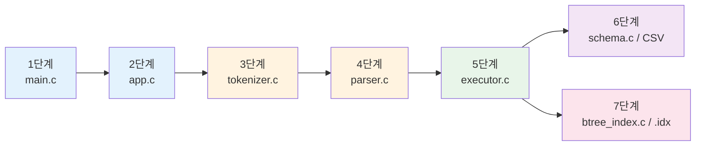

### 공부할 때 계속 떠올릴 질문

1. 지금 보는 함수의 입력은 무엇인가?
2. 이 함수는 문자열, 구조체, 파일 중 무엇을 바꾸는가?
3. 실패하면 어디로 돌아가고, 사용자에게 어떤 오류가 보이는가?

### 초심자용 한 줄 비유

- `tokenizer`는 문장을 낱말 카드로 자르는 단계
- `parser`는 낱말 카드를 문장 설계도로 바꾸는 단계
- `executor`는 설계도를 보고 실제 창고(CSV)에 물건을 넣거나 찾는 단계
- `B+ 트리 인덱스`는 창고에서 "몇 번째 칸"인지 빨리 찾는 색인표

---

## 2. 프로젝트 한 줄 요약

> **터미널에서 SQL을 입력하면, CSV 파일에 데이터를 읽고 쓰는 미니 데이터베이스**

지원하는 SQL:

```sql
-- 테이블에 행 삽입
INSERT INTO users VALUES (1, 'kim', 20);

-- 조건을 붙여 조회
SELECT * FROM users WHERE age >= 20;
SELECT name FROM users WHERE age >= 20 AND id = 1;

-- 인덱스 생성 (조회 속도 향상)
CREATE INDEX idx_users_age ON users(age);
```

---

## 3. 디렉토리 구조

```
week6-team5-sql/
├── include/
│   └── sqlproc.h       ← 모든 .c 파일이 공유하는 "공용 계약"
├── src/
│   ├── main.c          ← 프로그램 시작점 (진입점)
│   ├── app.c           ← 명령줄 인자 파싱, REPL 루프
│   ├── tokenizer.c     ← SQL 문자열 → 토큰 조각
│   ├── parser.c        ← 토큰 → 구문 트리(AST)
│   ├── schema.c        ← 테이블 스키마 파일 읽기
│   ├── executor.c      ← SQL 문장 실제 실행
│   └── btree_index.c   ← B+ 트리 인덱스 관리
├── tests/
│   └── test_runner.c   ← 단위 테스트
├── examples/
│   ├── schemas/users.schema
│   └── demo.sql
└── Makefile
```

### C에서 헤더(.h)와 소스(.c)의 관계

```
sqlproc.h               (설계도 — 구조체, 함수 선언)
    ↑ #include
tokenizer.c  parser.c  executor.c ...  (실제 구현체)
```

> **비유**: `.h`는 레스토랑 메뉴판(무슨 요리가 있는지), `.c`는 주방(요리를 실제로 만드는 곳).

---

## 4. 전체 실행 흐름

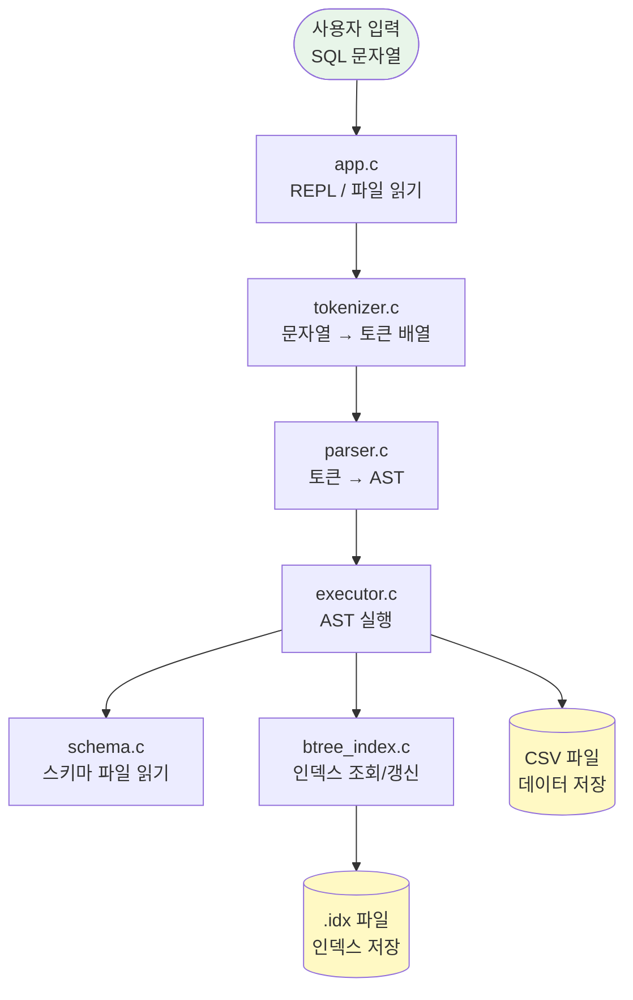

### 단계별 변환 예시

SQL 한 줄 `SELECT * FROM users WHERE age >= 20;`이 어떻게 처리되는지 따라가 봅니다.

**① 토큰화** (문자열 → 조각)

```
"SELECT * FROM users WHERE age >= 20;"

[SELECT] [*] [FROM] [users] [WHERE] [age] [>=] [20] [;] [EOF]
```

**② 파싱** (조각 → 구조체)

```c
SelectStatement {
    table_name   = "users"
    select_all   = 1            // SELECT *
    where_clause = {
        count    = 1
        items[0] = {
            column_name   = "age"
            operator_type = COMPARE_GREATER_EQUAL
            value         = { type=LITERAL_INT, text="20" }
        }
    }
}
```

**③ 실행** (구조체 → 파일 I/O)

```
1. users.schema 로드
2. users.csv 열기
3. age 컬럼에 인덱스가 있으면 → 인덱스로 후보 행 찾기
4. 없으면 → CSV 전체를 줄마다 확인 (Full Scan)
5. 조건(age >= 20) 만족하는 행만 출력
```

### 메모리와 파일이 어떻게 오가는가

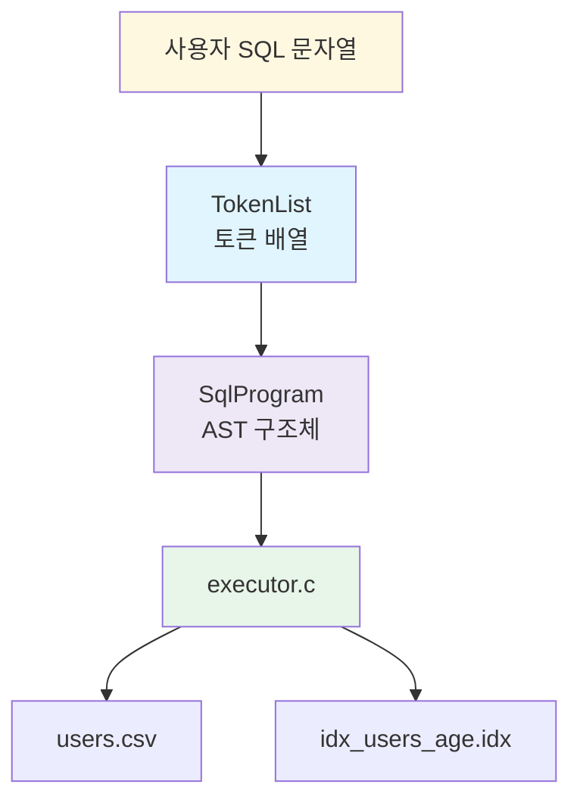

이 그림에서 중요한 점은 아래와 같습니다.

- 처음에는 그냥 문자열입니다.
- 중간에는 메모리 안 구조체입니다.
- 마지막에는 실제 디스크 파일입니다.

즉 이 프로그램은 "문자열을 구조체로 바꾸고, 구조체를 파일 동작으로 바꾸는"
프로그램입니다.

---

## 5. 모듈별 역할

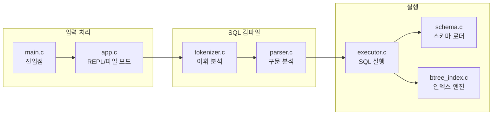

| 파일 | 주요 함수 | 한 줄 설명 |
|------|-----------|------------|
| `main.c` | `main()` | `run_program()` 호출 후 종료 |
| `app.c` | `run_program()`, `run_interactive_mode()` | REPL 루프, 세미콜론까지 입력 누적 |
| `tokenizer.c` | `tokenize_sql()` | 문자열을 `TokenList`로 변환 |
| `parser.c` | `parse_program()` | `TokenList`를 `SqlProgram`(AST)으로 변환 |
| `schema.c` | `load_table_schema()` | `.schema` 파일 읽어 `TableSchema` 반환 |
| `executor.c` | `execute_program()` | INSERT/SELECT/CREATE INDEX 실행 |
| `btree_index.c` | `update_all_indexes_for_row()`, `try_collect_offsets_from_indexes()` | B+ 트리 인덱스 CRUD |

---

## 6. 중앙 헤더 sqlproc.h 읽는 법

모든 모듈이 공유하는 타입과 상수가 `include/sqlproc.h` 하나에 모여 있습니다.

### 상수 (크기 제한)

```c
#define SQLPROC_MAX_NAME_LEN    64   // 컬럼명·테이블명 최대 63자
#define SQLPROC_MAX_COLUMNS     16   // 한 테이블 최대 16개 컬럼
#define SQLPROC_MAX_PREDICATES   2   // WHERE 조건 최대 2개
#define SQLPROC_BTREE_MAX_KEYS   4   // B+ 트리 노드 최대 4개 키
```

> C에서는 배열 크기를 미리 정해야 해서 이런 `#define` 상수를 자주 씁니다.  
> 이 값을 넘으면 프로그램이 오류를 반환합니다.

### 핵심 열거형(enum)

```c
// 토큰 종류
typedef enum {
    TOKEN_EOF,           // 입력 끝
    TOKEN_IDENTIFIER,    // 테이블명, 컬럼명 등
    TOKEN_NUMBER,        // 숫자 리터럴
    TOKEN_KEYWORD_SELECT,
    TOKEN_KEYWORD_INSERT,
    // ...
} TokenType;

// SQL 문장 종류
typedef enum {
    STATEMENT_INSERT,
    STATEMENT_SELECT,
    STATEMENT_CREATE_INDEX
} StatementType;

// WHERE 비교 연산자
typedef enum {
    COMPARE_EQUAL,          // =
    COMPARE_LESS,           // <
    COMPARE_LESS_EQUAL,     // <=
    COMPARE_GREATER,        // >
    COMPARE_GREATER_EQUAL   // >=
} CompareOperator;
```

### 핵심 구조체 관계도

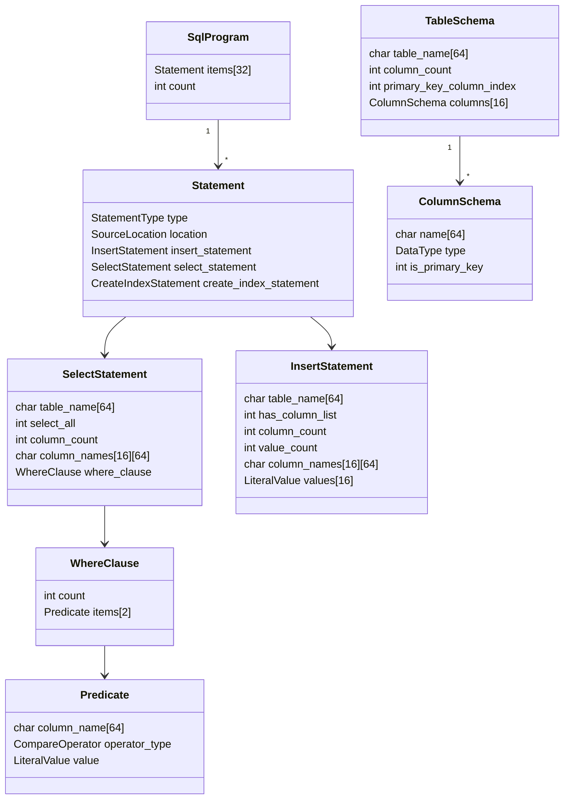

---

## 7. SQL 처리 3단계: 토큰화 → 파싱 → 실행

### 7-1. 토큰화 (tokenizer.c)

SQL 문자열을 의미 있는 조각(토큰)으로 자릅니다.

```c
// tokenize_sql() 호출 예시
TokenList tokens;
ErrorInfo error;
tokenize_sql("SELECT * FROM users;", &tokens, &error);

// 결과: tokens.items[]
// [0] type=TOKEN_KEYWORD_SELECT, text="SELECT"
// [1] type=TOKEN_STAR,           text="*"
// [2] type=TOKEN_KEYWORD_FROM,   text="FROM"
// [3] type=TOKEN_IDENTIFIER,     text="users"
// [4] type=TOKEN_SEMICOLON,      text=";"
// [5] type=TOKEN_EOF,            text=""
```

**토큰화 흐름:**

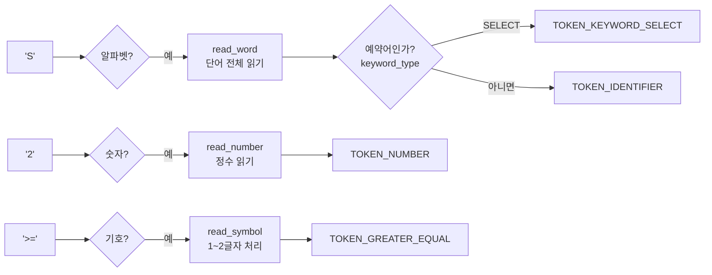

### 7-2. 파싱 (parser.c)

토큰 배열을 받아 AST(Abstract Syntax Tree, 구문 트리)를 만듭니다.  
재귀 하강 파서(Recursive Descent Parser) 패턴을 사용합니다.

```c
// 파서 내부 핵심 패턴
static int consume_token(ParserState *state, TokenType expected, ErrorInfo *error) {
    Token *tok = current_token(state);
    if (tok->type != expected) {
        // 오류: 예상한 토큰이 아님
        return 0;
    }
    state->pos++;   // 다음 토큰으로 이동
    return 1;
}
```

**SELECT 파싱 흐름:**

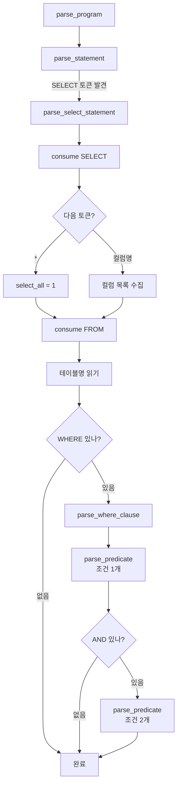

### 7-3. 실행 (executor.c)

AST를 받아 실제 파일 I/O를 수행합니다.

**INSERT 실행 흐름:**

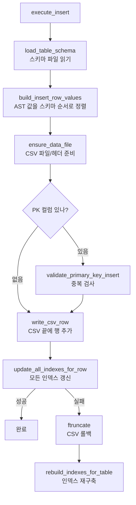

**SELECT 실행 흐름 (인덱스 활용):**

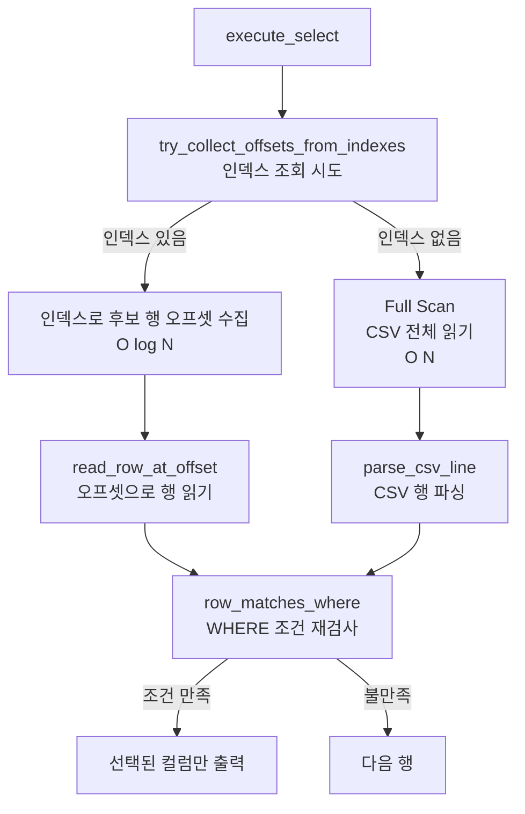

---

## 8. 데이터 저장 방식 (CSV)

### 스키마 파일 (.schema)

```
examples/schemas/users.schema:

id:int:pk,name:string,age:int
```

- 형식: `컬럼명:타입:제약조건`
- 타입: `int` 또는 `string`
- 제약: `pk` (Primary Key, 중복 불가)

### 데이터 파일 (.csv)

```csv
id,name,age
1,kim,20
2,"lee, junior",30
3,"quote ""test""",25
```

- 첫 줄: 헤더 (스키마 순서와 일치해야 함)
- 쉼표나 큰따옴표를 포함한 값은 `"..."` 로 감쌈
- 내부 큰따옴표는 `""` 로 이스케이프

### CSV 파일 내 오프셋(offset)

```
파일 내용:                    파일 오프셋(바이트 위치)
id,name,age\n                 ← 0
1,kim,20\n                    ← 12  (헤더 길이)
2,lee,30\n                    ← 21
3,park,25\n                   ← 30
```

인덱스는 이 바이트 오프셋을 저장해 두고, SELECT 시 `fseek()`으로 해당 위치로 바로 이동합니다.

---

## 9. B+ 트리 인덱스

### 왜 인덱스가 필요한가?

```
users.csv 행이 100만 개일 때:

인덱스 없음: 1번 행부터 100만 번 읽어야 함 → O(N)
인덱스 있음: 트리를 타고 내려가 바로 찾음   → O(log N)
```

### B+ 트리 구조

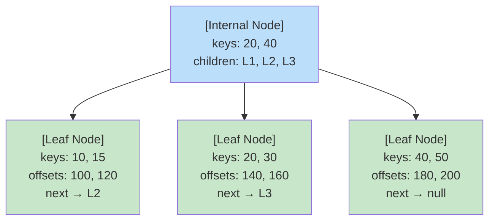

- **Internal Node**: 키만 저장, 자식 노드로 경로 안내
- **Leaf Node**: 키 + CSV 파일 내 행 오프셋 저장, 연결 리스트로 이어짐

### BTreeNode 구조체

```c
// btree_index.c 내부 구조체
typedef struct {
    int  is_leaf;                              // 1=리프, 0=내부
    int  key_count;                            // 현재 저장된 키 수
    int  next_leaf_id;                         // 다음 리프 노드 ID (리프만 사용)
    char keys[SQLPROC_BTREE_MAX_KEYS]          // 최대 4개 키
             [SQLPROC_MAX_VALUE_LEN];
    long row_offsets[SQLPROC_BTREE_MAX_KEYS];  // CSV 오프셋 (리프만 사용)
    int  child_ids[SQLPROC_BTREE_MAX_KEYS + 1];// 자식 ID (내부만 사용)
} BTreeNode;
```

### 인덱스 파일 레이아웃

```
users_age.idx:
┌─────────────────┐  ← 파일 시작
│  IndexHeader    │    magic="SQLIDX1", 인덱스 메타정보
├─────────────────┤
│  BTreeNode[0]   │    루트 노드
├─────────────────┤
│  BTreeNode[1]   │    자식 노드
├─────────────────┤
│  BTreeNode[2]   │    ...
└─────────────────┘
```

### 삽입 시 노드 분할 (Split)

```
노드가 가득 찰 때 (key_count == SQLPROC_BTREE_MAX_KEYS):

분할 전:           분할 후:
[10, 20, 30, 40]  →  [10, 20]  [30, 40]
                         ↑ 중간 키(30)가 부모로 올라감
```

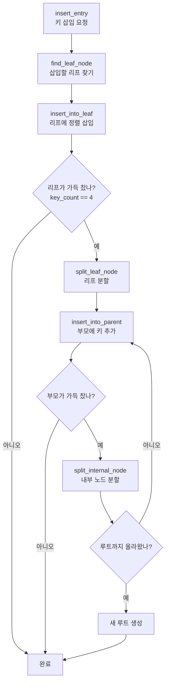

### SELECT에서 인덱스 활용

```sql
SELECT * FROM users WHERE age >= 20 AND id = 1;
```

```
1. age 컬럼에 인덱스 있음 → try_collect_offsets_from_indexes() 호출
2. 리프 노드를 순서대로 탐색하며 age >= 20 인 오프셋 수집
   → [offset_140, offset_160, offset_180, offset_200]
3. 각 오프셋에서 행 읽기 (fseek + fgets)
4. AND id = 1 조건도 재검사 (인덱스는 age만 처리)
5. 최종 조건 만족 행만 출력
```

---

## 10. 오류 처리 패턴

이 프로젝트의 모든 함수는 같은 방식으로 오류를 반환합니다.

```c
// 함수 시그니처 패턴
int some_function(..., ErrorInfo *error);
//  ↑ 반환값: 1=성공, 0=실패
//                       ↑ 오류 상세 정보를 여기에 기록

// 사용 예시 (executor.c에서)
TableSchema schema;
if (!load_table_schema(config->schema_dir, table_name, &schema, error)) {
    return 0;  // 오류 정보는 이미 error에 담겨 있음
}
```

```c
// ErrorInfo 구조체
typedef struct {
    char message[256];  // 오류 메시지
    int  line;          // SQL 내 줄 번호 (없으면 0)
    int  column;        // SQL 내 열 번호 (없으면 0)
} ErrorInfo;
```

**오류 전파 흐름:**

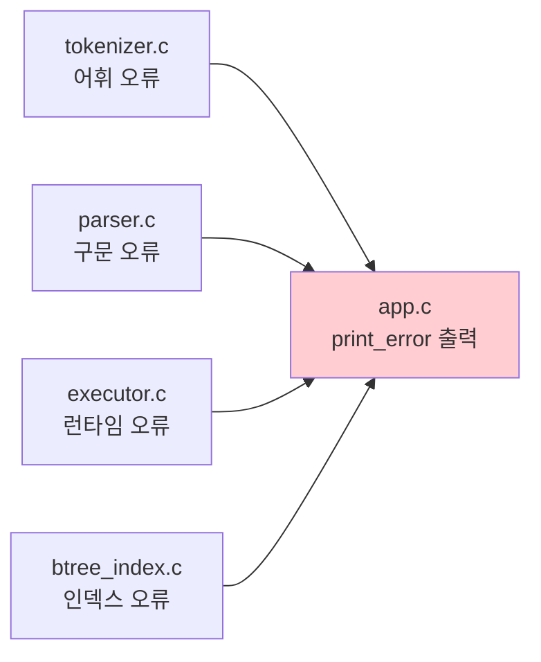

> **C 초보자 팁**: C에는 `try/catch`가 없습니다. 대신 함수가 `int`(성공/실패)를 반환하고,  
> 오류 상세는 포인터(`ErrorInfo *error`)로 전달받는 관례를 씁니다.

---

## 11. 빌드 및 실행 방법

### 빌드

```bash
make          # build/sqlproc 생성
make test     # 테스트 실행
make clean    # build/ 삭제
```

### 실행 (REPL 모드)

```bash
./build/sqlproc \
  --schema-dir examples/schemas \
  --data-dir   /tmp/data \
  --index-dir  /tmp/index

# 프롬프트 표시 후 SQL 입력
sql> INSERT INTO users VALUES (1, 'kim', 20);
sql> SELECT * FROM users;
sql> quit
```

### 실행 (파일 모드)

```bash
./build/sqlproc \
  --schema-dir examples/schemas \
  --data-dir   /tmp/data \
  --index-dir  /tmp/index \
  examples/demo.sql
```

### 스키마 파일 예시

```
# examples/schemas/users.schema
id:int:pk,name:string,age:int
```

---

## 부록: 코드 읽기 순서 추천

처음 코드를 읽을 때는 이 순서를 따르면 전체 맥락이 잡힙니다.

```
1. include/sqlproc.h       ← 전체 타입 훑어보기 (30분)
2. src/main.c              ← 진입점 확인 (5분)
3. src/app.c               ← REPL 루프 이해 (20분)
4. src/tokenizer.c         ← tokenize_sql() 함수 (20분)
5. src/parser.c            ← parse_select_statement() 함수 (30분)
6. src/schema.c            ← load_table_schema() 함수 (15분)
7. src/executor.c          ← execute_select() 함수 (30분)
8. src/btree_index.c       ← insert_entry() 함수 (1시간)
```

> B+ 트리는 가장 복잡한 부분입니다. 7번까지 이해한 후 마지막으로 도전하세요.
