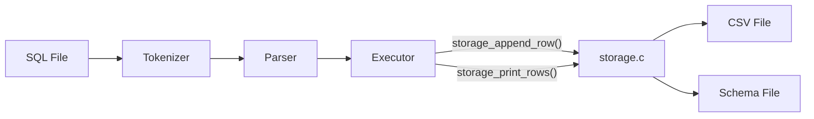
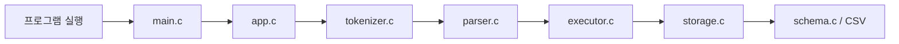
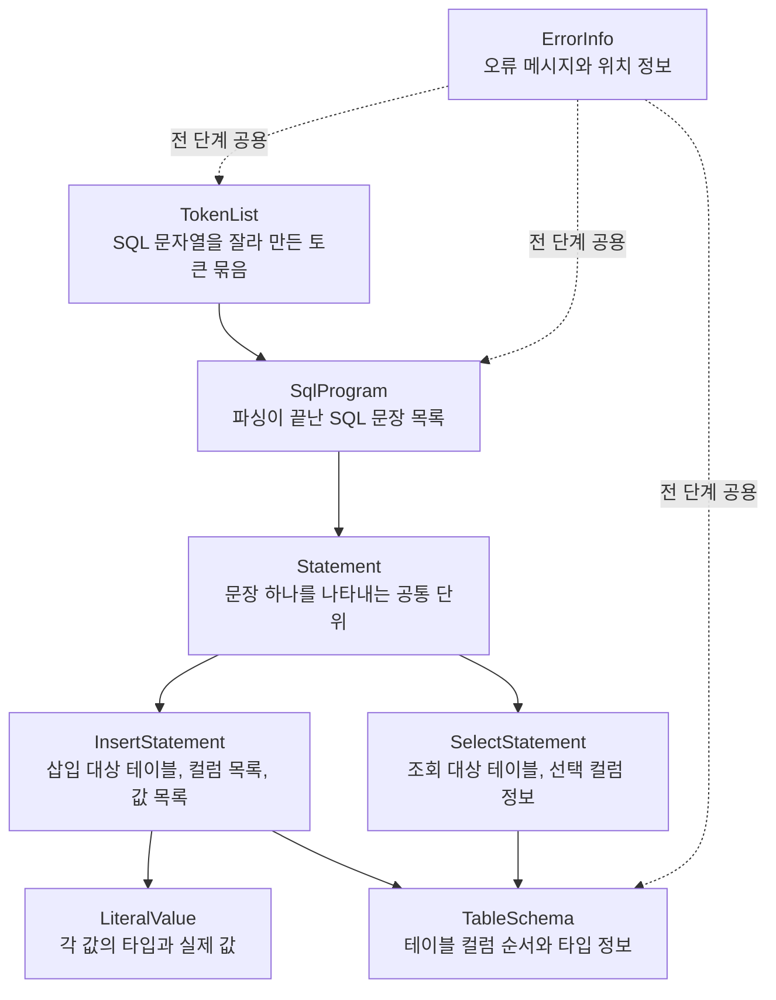
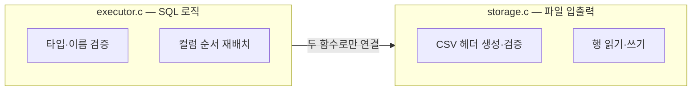

# `week6-team5-sql`

> SQL 처리 과정을 가장 작은 범위로 압축해, 내부 흐름이 보이도록 만든 교육용 SQL 처리기

## 한눈에 보기

| 항목 | 내용 |
| --- | --- |
| 목표 | SQL 실행 흐름을 초심자도 따라갈 수 있게 구현 |
| 입력 | `.sql` 파일 |
| 출력 | 표준 출력 + `.csv` 파일 |
| 지원 문장 | `INSERT`, `SELECT` |
| 저장 방식 | `CSV` |
| 스키마 | `<table>.schema` |

## 시스템 구조



executor.c는 SQL 로직(검증·배치)만 담당하고, 파일 읽기/쓰기는 storage.c에 완전히 위임합니다.

## 실행 흐름



## 핵심 구조체 관계도



## 지원 SQL

```sql
INSERT INTO users VALUES (1, 'kim', 20);
INSERT INTO users (name, id, age) VALUES ('lee', 2, 30);
SELECT * FROM users;
SELECT name, age FROM users;
```

## 시연 예시

```bash
./build/sqlproc \
  --schema-dir ./examples/schemas \
  --data-dir /tmp/demo-data \
  ./examples/demo.sql
```

```text
id      name    age
20      yoon    100
2       lee     30
3       park    40
id      name
20      yoon
2       lee
3       park
```

## 우리 팀의 포인트

### 1. tokenizer와 parser를 분리해 오류를 단계별로 설명

| 단계 | 대표 메시지 |
| --- | --- |
| Tokenizer | `지원하지 않는 문자를 찾았습니다.` |
| Tokenizer | `문자열 리터럴이 닫히지 않았습니다.` |
| Parser | `FROM 키워드가 필요합니다.` |
| Parser | `문장 끝에는 세미콜론이 필요합니다.` |
| Parser | `컬럼 수와 값 수가 일치하지 않습니다.` |

### 2. 오류 위치를 함께 출력

```text
오류: 지원하지 않는 문자를 찾았습니다. (line 1, column 8)
오류: FROM 키워드가 필요합니다. (line 1, column 13)
```

### 3. 스키마 기반으로 컬럼 순서와 타입을 검증

```text
id:int,name:string,age:int
```

- 컬럼 순서 기준을 통일
- `int`, `string` 타입 검증
- 컬럼 목록이 바뀌어도 이름 기준으로 재배치

### 4. executor와 storage를 분리해 역할을 명확히 구분



- `storage_append_row()` — INSERT 시 CSV에 한 행 추가
- `storage_print_rows()` — SELECT 시 해당 컬럼만 출력
- storage.c를 교체해도 executor.c를 건드릴 필요가 없음

## 협업과 회고

| 주제 | 내용 |
| --- | --- |
| 리뷰 방식 | `AGENTS.md`의 멀티 페르소나 관점을 참고해 에이전트를 리뷰어처럼 활용 |
| 협업 방식 | 한 컴퓨터에서 상세 프롬프트를 작성하고 같은 환경에서 바로 빌드·테스트 |
| 효과 | 정확성, 자료구조 일관성, 초심자 가독성을 분리해 점검 가능 |

## 한 줄 정리

> `week6-team5-sql`은 SQL 처리 과정을 가장 작은 범위로 압축해, 내부 흐름이 보이도록 만든 교육용 SQL 처리기입니다.

## CSV 저장 규칙

- 첫 줄은 항상 헤더입니다.
- 첫 `INSERT` 때 파일이 없으면 헤더를 자동으로 만듭니다.
- 스키마와 헤더가 다르면 오류를 반환하고 실행을 중단합니다.

## 초심자에게 중요한 코드 읽기 포인트

- [src/parser.c](src/parser.c)
  `INSERT`, `SELECT`를 수동 파싱합니다.
- [src/executor.c](src/executor.c)
  문장 구조체를 검증하고 스토리지 호출로 연결합니다.
- [src/storage.c](src/storage.c)
  CSV 경로, 헤더, 행 저장/출력을 담당합니다.
- [tests/test_runner.c](tests/test_runner.c)
  기능별 테스트 흐름을 한 파일에서 따라갈 수 있습니다.
- [docs/storage-executor.md](docs/storage-executor.md)
  executor.c · storage.c의 함수 흐름을 초심자용으로 정리한 문서입니다.

## Git 브랜치와 GitHub 절차

이 저장소는 아래 규칙으로 개발합니다.

- 기본 브랜치: `main`
- 개발 통합 브랜치: `dev`
- 기능 브랜치: `feature/<기능명>`

모든 merge 전에는 아래 순서를 지킵니다.

1. 세션 로그를 Markdown 파일로 기록합니다.
2. 멀티 페르소나 코드 리뷰를 진행합니다.
3. GitHub Issue를 새로 만듭니다.
4. 이슈를 `6주차 5조 미니 SQL 처리기 보드`에 추가합니다.
5. 이슈 코멘트에 한국어 검증 결과를 남깁니다.
6. PR을 생성합니다.
7. 테스트 통과 후 merge합니다.

## 현재 테스트 범위

- 인자 파싱 (성공·실패)
- 토크나이저 (SELECT 문장)
- `INSERT` 파서 (컬럼 목록 있음·없음)
- 빈 SQL 파일 오류
- CSV 기반 `INSERT`와 `SELECT` 통합 실행
- `storage_print_rows()` 파일 없음·헤더 불일치 케이스
