# `week6-team5-sql`

> SQL 처리 과정을 가장 작은 범위로 압축해, 내부 흐름이 보이도록 만든 교육용 SQL 처리기

## 한눈에 보기

| 항목      | 내용                                         |
| --------- | -------------------------------------------- |
| 목표      | SQL 실행 흐름을 초심자도 따라갈 수 있게 구현 |
| 입력      | `.sql` 파일                                  |
| 출력      | 표준 출력 + `.csv` 파일                      |
| 지원 문장 | `INSERT`, `SELECT`                           |
| 저장 방식 | `CSV`                                        |
| 스키마    | `<table>.schema`                             |

## 시스템 구조

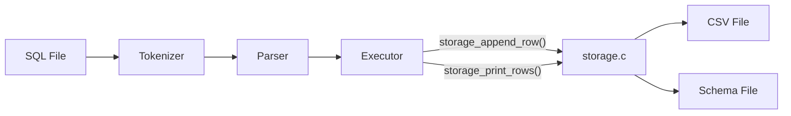

## 핵심 구조체

| 구조체            | 역할                             | 생성 단계     | 포함                                   |
| ----------------- | -------------------------------- | ------------- | -------------------------------------- |
| `TokenList`       | SQL 문자열을 잘라낸 토큰 배열    | `tokenizer.c` | `Token[]`                              |
| `SqlProgram`      | 파싱된 SQL 문장 목록             | `parser.c`    | `Statement[]`                          |
| `Statement`       | `INSERT` / `SELECT` 구분 단위    | `parser.c`    | `InsertStatement` or `SelectStatement` |
| `InsertStatement` | 테이블명, 컬럼명[], 값[]         | `parser.c`    | `LiteralValue[]`                       |
| `SelectStatement` | 테이블명, `select_all`, 컬럼명[] | `parser.c`    | —                                      |
| `TableSchema`     | 컬럼 순서·타입 정의              | `schema.c`    | `ColumnSchema[]`                       |
| `ErrorInfo`       | 오류 메시지 + 위치               | 전 단계 공용  | —                                      |

### 구조체 관계도

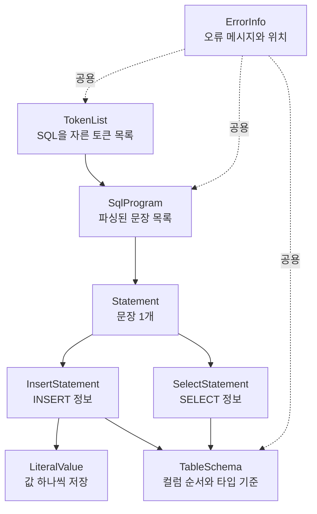

### 구조체를 사용하는 이유

- tokenizer 결과와 parser 결과를 단계별로 분리해서 저장하기 위해 사용했습니다.
- `INSERT`, `SELECT`를 문자열이 아니라 정리된 데이터 형태로 넘기기 위해 사용했습니다.
- executor가 스키마 기준으로 컬럼 순서와 타입을 확인하기 쉽게 만들기 위해 사용했습니다.
- 오류가 어느 단계에서 났는지 같은 형식으로 기록하기 위해 사용했습니다.

### 구조체를 사용했을 때 장점

- 각 단계가 어떤 데이터를 받고 어떤 데이터를 만드는지 바로 보입니다.
- tokenizer, parser, executor 역할이 섞이지 않습니다.
- `INSERT`, `SELECT` 문장을 같은 `Statement` 단위로 관리할 수 있습니다.
- 디버깅할 때 문자열 전체를 다시 읽지 않고, 정리된 결과만 보면 됩니다.
- 발표에서도 "문자열 -> 토큰 -> 문장 구조체 -> 실행" 흐름을 설명하기 쉽습니다.

## 실행 흐름

전체 흐름은  
`프로그램 실행 -> main.c(진입점) -> app.c -> tokenizer.c -> parser.c -> executor.c -> schema.c / CSV`  
입니다.

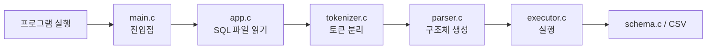

### 1. `main.c`와 `app.c`

`main.c`는 프로그램의 진입점입니다.  
실행 인자를 확인한 뒤, 실제 SQL 처리 흐름은 `app.c`로 넘깁니다.  
`app.c`에서는 SQL 파일 전체를 읽어서 tokenizer 단계로 전달합니다.

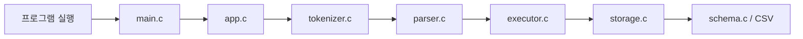

### 2. `tokenizer.c`

tokenizer는 SQL 문자열을 토큰 단위로 자릅니다.

예시:

```sql
SELECT name, age FROM users;
```

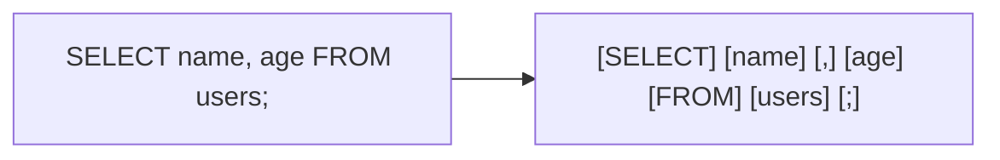

즉, 문장 전체를 한 번에 처리하지 않고  
키워드, 컬럼명, 쉼표, 세미콜론 같은 조각으로 먼저 나눕니다.

### 3. `parser.c`

parser는 tokenizer가 만든 토큰을 읽고  
이 문장이 `INSERT`인지 `SELECT`인지 구분한 뒤 구조체에 담습니다.

예를 들어 아래 토큰은

```text
[SELECT] [name] [,] [age] [FROM] [users] [;]
```

parser를 거치면 `SelectStatement` 구조체로 정리됩니다.

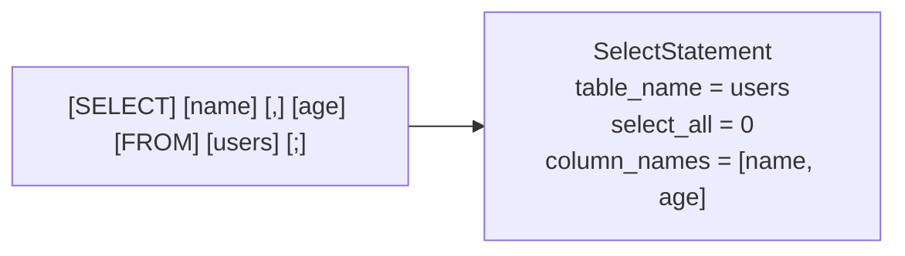

구조체 기준으로 보면 아래처럼 설명할 수 있습니다.

```text
SelectStatement
- table_name: users
- select_all: 0
- column_names: [name, age]
```

`INSERT`도 같은 방식입니다.

```sql
INSERT INTO users (name, id, age) VALUES ('kim', 1, 20);
```

이 문장은 parser를 거치면 다음처럼 정리됩니다.

```text
InsertStatement
- table_name: users
- column_names: [name, id, age]
- values: ['kim', 1, 20]
```

즉, parser 단계는  
토큰 배열을 읽고 "무슨 문장인지", "어떤 테이블인지", "어떤 컬럼과 값인지"를  
구조체에 담아 주는 단계입니다.

### 4. `executor.c`

executor는 parser가 만든 구조체를 가지고  
실제 CSV 읽기/쓰기 작업을 수행합니다.

`SELECT` 예시:

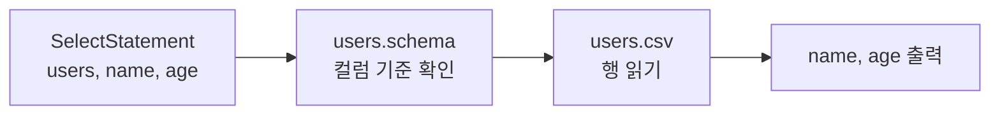

`INSERT` 예시:

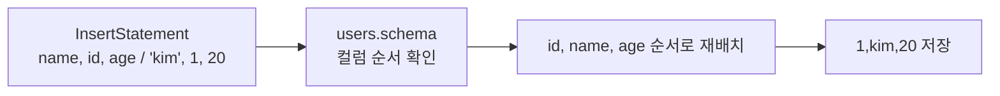

즉, executor 단계는  
구조체에 정리된 정보를 schema 기준으로 확인하고,  
CSV 파일에 반영하는 단계입니다.

## 지원 SQL

```sql
INSERT INTO users VALUES (1, 'kim', 20);
INSERT INTO users (name, id, age) VALUES ('lee', 2, 30);
SELECT * FROM users;
SELECT name, age FROM users;
```

## 시연 예시

```bash
./build/sqlproc \
  --schema-dir ./examples/schemas \
  --data-dir /tmp/demo-data \
  ./examples/demo.sql
```

```text
id      name    age
20      yoon    100
2       lee     30
3       park    40
id      name
20      yoon
2       lee
3       park
```

## 우리 팀의 포인트

### 1. tokenizer와 parser의 오류를 나눠서 처리

| 단계      | 대표 메시지                            |
| --------- | -------------------------------------- |
| Tokenizer | `지원하지 않는 문자를 찾았습니다.`     |
| Tokenizer | `문자열 리터럴이 닫히지 않았습니다.`   |
| Parser    | `FROM 키워드가 필요합니다.`            |
| Parser    | `문장 끝에는 세미콜론이 필요합니다.`   |
| Parser    | `컬럼 수와 값 수가 일치하지 않습니다.` |

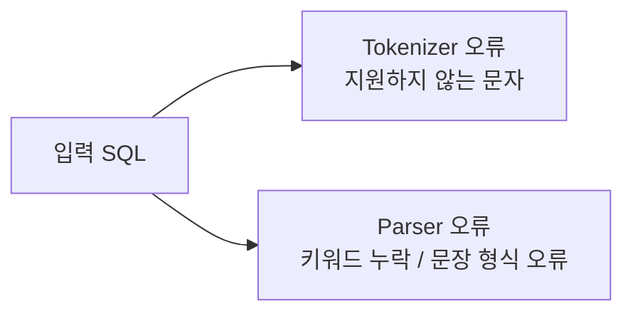

예시:

- tokenizer 오류: `SELECT @ FROM users;`
- parser 오류: `SELECT name users;`

### 2. 오류 위치까지 함께 출력

```text
오류: 지원하지 않는 문자를 찾았습니다. (line 1, column 8)
오류: FROM 키워드가 필요합니다. (line 1, column 13)
```

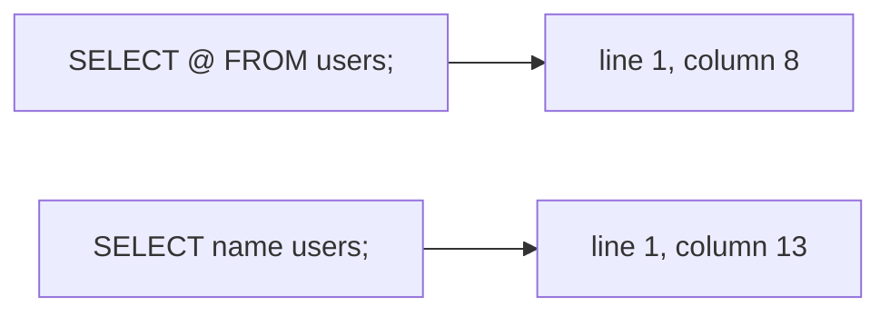

### 3. 스키마를 기준으로 컬럼 순서와 타입을 맞춤

```text
id:int,name:string,age:int
```

- 컬럼 순서를 통일합니다.
- `int`, `string` 타입을 검증합니다.
- 사용자가 컬럼 순서를 바꿔도 schema 기준으로 다시 맞춥니다.

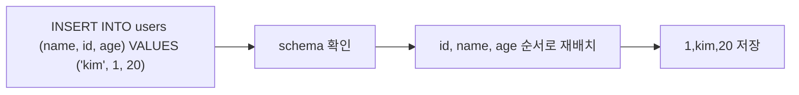

### 4. executor와 storage를 분리해 역할을 명확히 구분

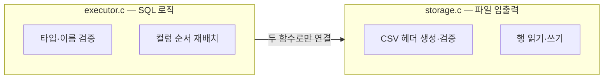

- `storage_append_row()` — INSERT 시 CSV에 한 행 추가
- `storage_print_rows()` — SELECT 시 해당 컬럼만 출력
- storage.c를 교체해도 executor.c를 건드릴 필요가 없음

## 협업과 회고

| 주제      | 내용                                                                  |
| --------- | --------------------------------------------------------------------- |
| 리뷰 방식 | `AGENTS.md`의 멀티 페르소나 관점을 참고해 에이전트를 리뷰어처럼 활용  |
| 협업 방식 | 한 컴퓨터에서 상세 프롬프트를 작성하고 같은 환경에서 바로 빌드·테스트 |
| 효과      | 정확성, 자료구조 일관성, 초심자 가독성을 분리해 점검 가능             |

### 작업 플로우

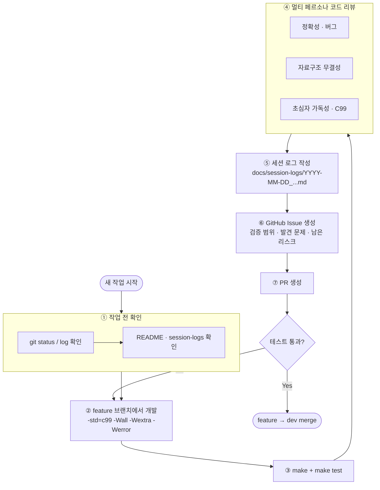
