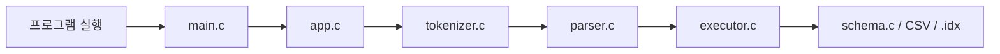
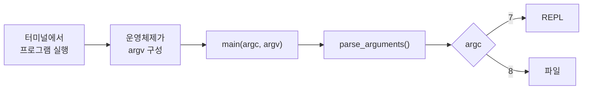
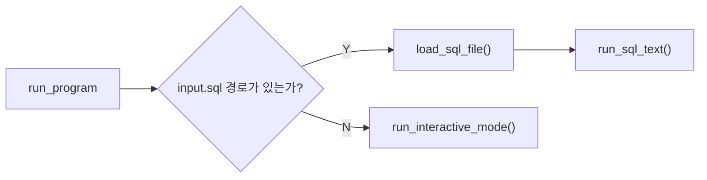
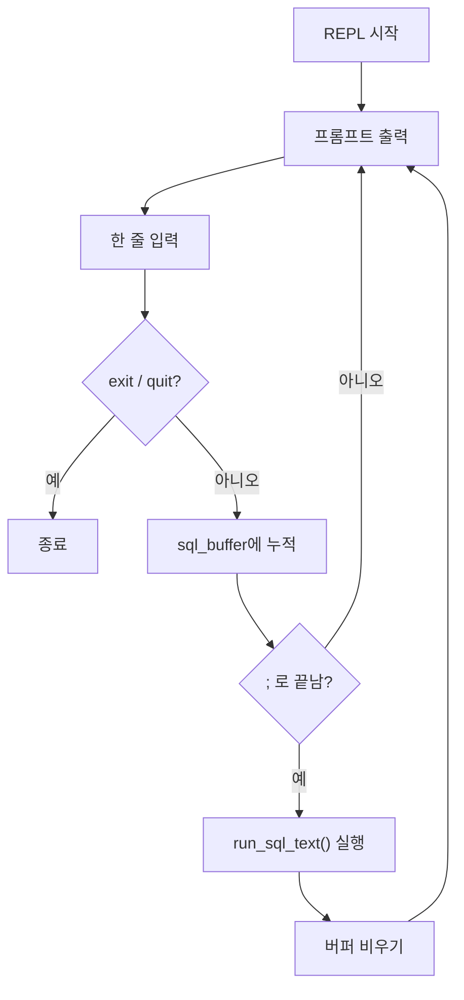
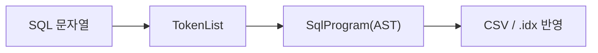
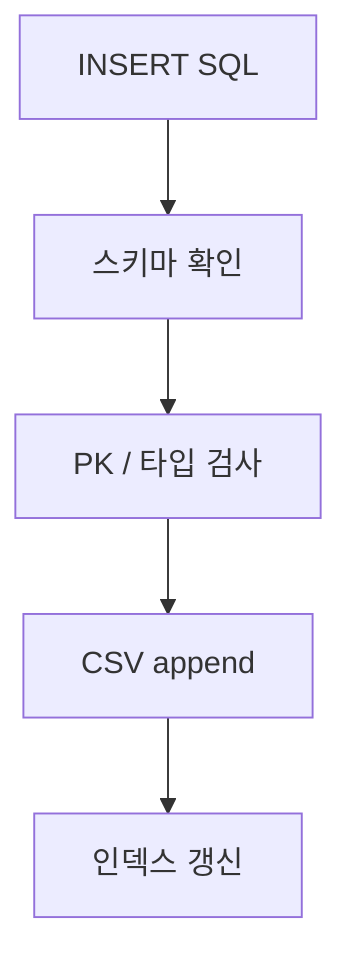
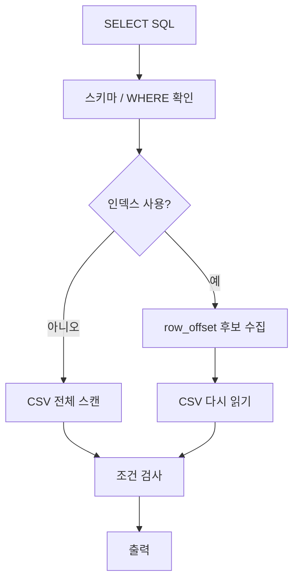

# sqlproc 코드 리딩 노트

이 문서는 `study/choeyeongbin-code-reading` 브랜치에서
`refactoring` 내용을 반영한 뒤 다시 정리한 개인 학습 노트입니다.

목표는 두 가지입니다.

- 지금 프로그램이 어떤 순서로 움직이는지 한 장으로 기억하기
- 코드를 읽을 때 "다음에 어느 파일을 보면 되는지" 바로 떠오르게 만들기

## 1. 프로그램 파이프라인



한 줄 요약:

> SQL 문자열을 받아서, 토큰과 AST로 해석하고, 마지막에 CSV와 인덱스 파일에 반영하는 프로그램

## 2. 프로그램 실행 방법


### 2-1. 터미널 명령어

먼저 프로그램을 빌드합니다.

```bash
make
```

`make`는 소스코드를 컴파일해서 실행 파일 `./build/sqlproc`를 만드는 명령어입니다.

빌드가 끝나면 아래 두 가지 방식으로 실행할 수 있습니다.

- REPL 모드:
  `REPL(Read-Eval-Print Loop)`은 터미널에서 SQL을 한 줄씩 입력하고,
  바로 실행 결과를 확인하는 대화형 모드입니다.

  schema-dir : 테이블 규칙
  

```bash
./build/sqlproc --schema-dir ./examples/schemas --data-dir ./demo-data --index-dir ./demo-indexes
```

- 파일 모드:
  미리 작성한 SQL 파일을 한 번에 실행하는 모드입니다.

```bash
./build/sqlproc --schema-dir ./examples/schemas --data-dir ./demo-data --index-dir ./demo-indexes ./examples/demo.sql
```

### 2-2. 터미널 명령어에 넘기는 옵션

이 프로그램은 실행할 때 아래 세 가지 경로를 알아야 합니다.

- `--schema-dir`
  테이블 규칙이 들어 있는 디렉터리입니다.
  예를 들어 `users` 테이블을 읽을 때는
  `./examples/schemas/users.schema` 같은 파일을 찾습니다.

- `--data-dir`
  실제 CSV 데이터 파일이 저장되는 디렉터리입니다.
  예를 들어 `users` 테이블 데이터는
  `./demo-data/users.csv` 같은 파일에 저장됩니다.

- `--index-dir`
  B+ 트리 인덱스 파일이 저장되는 디렉터리입니다.
  예를 들어 `CREATE INDEX idx_users_age ON users(age);`를 실행하면
  `./demo-indexes/idx_users_age.idx` 같은 파일이 생깁니다.

쉽게 비유하면:

- `schema-dir` = 양식 설명서 보관함
- `data-dir` = 실제 데이터 보관함
- `index-dir` = 빨리 찾기 위한 색인표 보관함

왜 이 값을 인자로 넘기냐면,
프로그램이 실행될 때마다 어떤 스키마 폴더, 어떤 데이터 폴더,
어떤 인덱스 폴더를 쓸지 바꿀 수 있어야 하기 때문입니다.

예를 들어 아래 명령은:

```bash
./build/sqlproc --schema-dir ./examples/schemas --data-dir ./demo-data --index-dir ./demo-indexes
```

프로그램에게 이렇게 말하는 것과 같습니다.

- 스키마는 `./examples/schemas`에서 읽어라
- 데이터는 `./demo-data`에서 읽고 써라
- 인덱스는 `./demo-indexes`에 저장해라


## 3. 각 파일 별 역할

### 3-1. main.c

`main.c`는 프로그램 시작점입니다.

프로그램이 실행되기 전에는 아래 과정이 먼저 일어납니다.

- 사용자가 터미널에 명령어를 입력합니다.
- 쉘이 명령어를 공백 기준으로 나누어 실행 파일 경로와 인자 목록을 만듭니다.
- 운영체제가 실행 파일을 메모리에 올리고, 프로그램 실행에 필요한 스택과 실행 환경을 준비합니다.
- 이때 쉘로부터 받은 인자 목록으로 `argv`, 인자 개수인 `argc`, 환경 변수 목록인 `envp`도 함께 준비됩니다.
- 그 뒤 C 런타임을 거쳐 `main(argc, argv)`가 호출됩니다.

`main.c` 안에서는 아래 일을 합니다.

- 운영체제가 준비한 `argc`, `argv`를 받습니다.
- `parse_arguments()`를 호출해 명령행 인자를 `AppConfig` 프로그램 실행 설정을 담는 구조체로 정리합니다.
- 인자 형식이 올바르면 `run_program()`에 실행을 넘깁니다.

즉 `main.c`는 SQL을 직접 실행하는 곳이라기보다,
프로그램 실행에 필요한 입력 정보를 받아 다음 단계로 넘기는 입구 역할을 합니다.

### 3-2. app.c

`app.c`는 실행 흐름 관리자입니다.

핵심 역할:

- 파일 모드인지 REPL 모드인지 결정
- SQL 한 문장이 완성됐는지 판단
- 완성된 SQL을 `run_sql_text()`로 넘김
- 오류가 나면 사용자에게 출력

특히 중요한 점:

- 파일 모드와 REPL 모드는 처음만 다릅니다.
- 중간부터는 둘 다 `run_sql_text()`로 합쳐집니다.

#### 3-2-1. parse_arguments()
- argv에 들어 있는 명령행 인자들을 읽어서 AppConfig 구조체에 정리하는 함수입니다.

#### 3-2-2. run_program()

- `main.c`가 넘겨준 `AppConfig`를 받아 최종적으로 어떤 방식으로 SQL을 실행할지 결정하는 함수입니다.



1. `AppConfig` 안의 `has_input_path` 값을 확인합니다.
2. SQL 파일 경로가 없으면 REPL 모드로 들어갑니다.
3. SQL 파일 경로가 있으면 파일 내용을 읽습니다.
4. 준비된 SQL 문자열을 `run_sql_text()`로 넘깁니다.
5. 실패하면 오류를 출력하고 종료 코드를 반환합니다.

#### 3-2-3. run_interactive_mode()
- 사용자가 SQL을 한 줄씩 입력하면, 세미콜론(;)이 나올 때까지 모았다가 실행하고, 다시 다음 입력을 받는 함수입니다.


1. 종료 명령인지 검사합니다.
2. 종료 명령이면 run_sql_text()를 실행하지 않고 바로 함수를 종료합니다.
3. 종료 명령이 아니면 입력한 내용을 sql_buffer에 누적합니다.
4. 문장이 세미콜론(;)으로 끝나면 run_sql_text(config, sql_buffer, &error)를 실행합니다.

#### 3-2-4. run_sql_text()

- SQL 문자열 1개를 실제 실행 파이프라인으로 넘기는 공통 함수입니다.

이 함수는 아래 세 단계를 순서대로 수행합니다.

1. `tokenize_sql()`
   SQL 문자열을 토큰으로 나눕니다.
2. `parse_program()`
   토큰 배열을 AST 구조체로 바꿉니다.
3. `execute_program()`
   AST를 실제 SQL 동작으로 실행합니다.

즉 이 함수는 문자열 형태의 SQL을 받아
`토큰화 -> 파싱 -> 실행`
순서로 연결하는 역할을 합니다.

### 3-3. tokenizer.c

- `tokenizer.c`는 SQL 문자열을 토큰 목록(`TokenList`)으로 바꾸는 파일입니다.

즉 사람이 입력한 긴 문자열을,
파서가 읽기 쉬운 작은 조각들로 자르는 단계입니다.

예를 들어:

```sql
SELECT * FROM users WHERE age >= 20;
```

이 문자열은 대략 아래처럼 잘립니다.

```text
[SELECT] [*] [FROM] [users] [WHERE] [age] [>=] [20] [;] [EOF]
```

핵심 함수:

- `tokenize_sql()`
  SQL 문자열 전체를 처음부터 끝까지 읽으며 토큰을 만듭니다.
- `read_word()`
  `SELECT`, `users`, `age` 같은 단어를 읽습니다.
- `read_number()`
  `20`, `-5` 같은 숫자를 읽습니다.
- `read_string()`
  `'kim'` 같은 문자열 리터럴을 읽습니다.
- `read_symbol()`
  `,`, `;`, `(`, `)`, `<=`, `>=` 같은 기호를 읽습니다.

왜 필요한가:

- parser는 긴 문자열을 직접 읽기 어렵습니다.
- 그래서 먼저 tokenizer가 문장을 "의미 있는 조각"으로 잘라줘야 합니다.

입력과 출력:

- 입력: SQL 문자열
- 출력: `TokenList`

한 줄 요약:

- `tokenizer.c`는 SQL 문자열을 토큰 목록으로 변환하는 파일입니다.

### 3-4. parser.c

- `parser.c`는 토큰 목록(`TokenList`)을 읽어 AST 구조체(`SqlProgram`)로 바꾸는 파일입니다.
- AST는 Abstract Syntax Tree의 약자로 SQL 문장의 의미를 구조화한 결과입니다.

즉 tokenizer가 만든 조각들을 보고
"이 문장이 INSERT인지, SELECT인지, 어떤 테이블과 컬럼을 쓰는지"
를 구조체로 정리합니다.

예를 들어:

```sql
INSERT INTO users VALUES (1, 'kim', 20);
```

parser는 이 문장을 보고 대략 아래 정보를 만듭니다.

- 문장 종류: `INSERT`
- 테이블 이름: `users`
- 값 목록: `1`, `kim`, `20`

핵심 함수:

- `parse_program()`
  토큰 목록 전체를 읽어 `SqlProgram` AST를 만듭니다.
- `parse_statement()`
  현재 토큰을 보고 어떤 문장인지 결정합니다.
- `parse_insert_statement()`
  `INSERT` 문을 해석합니다.
- `parse_select_statement()`
  `SELECT` 문을 해석합니다.
- `parse_create_index_statement()`
  `CREATE INDEX` 문을 해석합니다.

왜 필요한가:

- executor는 문자열 원본을 직접 읽지 않고,
  정리된 구조체(AST)를 받아 실행합니다.
- 그래서 parser가 "문장 뜻"을 먼저 구조화해야 합니다.

입력과 출력:

- 입력: `TokenList`
- 출력: `SqlProgram` AST

중요:

- parser는 아직 CSV나 인덱스 파일을 만지지 않습니다.
- 여기서는 오직 SQL 문장의 구조를 이해해서 AST를 만드는 것만 합니다.

한 줄 요약:

- `parser.c`는 토큰 목록을 AST 구조체로 바꾸는 파일입니다.

### 3-5. executor.c

- `executor.c`는 parser가 만든 AST를 실제 동작으로 실행하는 파일입니다.

즉 여기서 처음으로 진짜 파일 작업이 일어납니다.

주요 역할:

- `INSERT`면 CSV 파일에 row를 추가합니다.
- `SELECT`면 CSV를 읽고 조건을 검사한 뒤 결과를 출력합니다.
- `CREATE INDEX`면 인덱스 파일 생성을 `btree_index.c`에 넘깁니다.

핵심 함수:

- `execute_program()`
  AST 안의 문장들을 순서대로 실행합니다.
- `execute_insert()`
  INSERT를 실행합니다.
- `execute_select()`
  SELECT를 실행합니다.
- `execute_create_index()`
  CREATE INDEX를 실행합니다.

INSERT에서 하는 일:

1. `schema.c`로 테이블 규칙을 읽습니다.
2. INSERT 값을 스키마 순서에 맞게 정리합니다.
3. CSV 헤더를 확인하거나 새로 만듭니다.
4. PK 중복을 검사합니다.
5. CSV 끝에 row를 추가합니다.
6. 관련 인덱스를 갱신합니다.

SELECT에서 하는 일:

1. 스키마와 WHERE 조건이 맞는지 확인합니다.
2. 인덱스를 쓸 수 있으면 row offset 후보를 먼저 모읍니다.
3. 아니면 CSV를 처음부터 끝까지 읽습니다.
4. 조건을 만족하는 행만 출력합니다.

왜 필요한가:

- parser는 문장을 이해만 하고 끝납니다.
- 실제 데이터를 읽고 쓰는 일은 executor가 맡아야 합니다.

입력과 출력:

- 입력: `SqlProgram` AST
- 출력: 실행 결과
  - `SELECT`는 화면 출력
  - `INSERT`, `CREATE INDEX`는 파일 반영

한 줄 요약:

- `executor.c`는 AST를 실제 CSV와 인덱스 파일 작업으로 바꾸는 파일입니다.

### 3-6. schema.c

- `schema.c`는 테이블 규칙을 읽는 파일입니다.

즉 실제 데이터가 아니라,
"이 테이블은 어떤 컬럼을 가지고 있고, 타입은 무엇이고, PK가 있는지"
같은 규칙 정보를 읽어 구조체로 정리합니다.

예를 들어 스키마 파일이 아래와 같다면:

```text
id:int:pk,name:string,age:int
```

`schema.c`는 이 한 줄을 읽어서 대략 아래 정보를 만듭니다.

- 컬럼 이름: `id`, `name`, `age`
- 컬럼 타입: `int`, `string`, `int`
- PK 컬럼: `id`

핵심 함수:

- `load_table_schema()`
  `.schema` 파일을 읽어 `TableSchema` 구조체를 만듭니다.

왜 필요한가:

- `INSERT`할 때 값 타입이 맞는지 확인해야 합니다.
- `SELECT`할 때 컬럼 이름이 실제로 존재하는지 확인해야 합니다.
- PK 중복 검사도 어떤 컬럼이 PK인지 알아야 가능합니다.

입력과 출력:

- 입력: 스키마 파일 경로
- 출력: `TableSchema`

중요:

- `schema.c`는 실제 row 데이터를 저장하지 않습니다.
- 규칙만 읽어서 다른 모듈이 사용할 수 있게 넘깁니다.

한 줄 요약:

- `schema.c`는 테이블의 규칙 정보를 읽어 `TableSchema`로 만드는 파일입니다.

### 3-7. btree_index.c

- `btree_index.c`는 B+ 트리 인덱스 파일을 관리하는 파일입니다.

쉽게 말하면:

- CSV는 원본 데이터 장부
- 인덱스는 빨리 찾기 위한 색인표

`btree_index.c`는 이 색인표 역할을 담당합니다.

주요 역할:

- `CREATE INDEX` 실행 시 `.idx` 파일 생성
- 기존 CSV 데이터를 읽어 인덱스 채우기
- `INSERT` 후 새 row에 대한 인덱스 추가
- `SELECT`에서 인덱스를 사용해 row offset 후보 찾기

핵심 함수:

- `create_index_from_statement()`
  CREATE INDEX 문을 실행합니다.
- `insert_entry()`
  인덱스 엔트리 1개를 B+ 트리에 넣습니다.
- `append_existing_rows()`
  기존 CSV 데이터를 읽어 새 인덱스를 채웁니다.
- `try_collect_offsets_from_indexes()`
  SELECT에서 사용할 row offset 후보를 모읍니다.

왜 필요한가:

- 인덱스가 없으면 SELECT는 CSV를 처음부터 끝까지 읽어야 합니다.
- 인덱스가 있으면 조건에 맞는 후보 위치를 더 빨리 찾을 수 있습니다.

인덱스 안에 저장되는 핵심 정보:

- `key`
  예: `age = 30`
- `row_offset`
  예: CSV 파일에서 그 row가 시작하는 바이트 위치

즉 인덱스는 row 전체를 저장하는 것이 아니라,
"어디에 있는지"를 저장합니다.

입력과 출력:

- 입력: 테이블 이름, 컬럼 이름, key, row offset 같은 인덱스 정보
- 출력: `.idx` 파일 갱신 또는 row offset 후보 목록

중요:

- 인덱스를 써도 실제 결과를 출력하려면 결국 CSV를 다시 읽어야 합니다.
- 인덱스는 위치를 빨리 찾도록 도와주는 보조 자료구조입니다.

한 줄 요약:

- `btree_index.c`는 빠른 조회를 위해 `.idx` 파일 기반 B+ 트리 인덱스를 관리하는 파일입니다.

## 4. 문자열이 파일 반영까지 바뀌는 과정

앞에서 각 파일 역할을 봤다면, 이제는 "무엇이 무엇으로 바뀌는지"만 기억하면 됩니다.



즉 이 프로그램은 아래 세 번의 변환으로 이해할 수 있습니다.

1. 문자열 -> 토큰
2. 토큰 -> AST
3. AST -> 실제 파일 작업

초심자 기준으로 가장 중요한 점:

- `tokenizer.c`는 문자열을 자릅니다.
- `parser.c`는 문장의 뜻을 구조체로 만듭니다.
- `executor.c`는 그 구조체를 바탕으로 진짜 파일을 만집니다.

## 5. INSERT와 SELECT에서 실제로 달라지는 것

파일별 역할을 외우기보다, `INSERT`와 `SELECT`가 무엇을 바꾸는지 보는 것이 더 기억에 남습니다.

### INSERT



기억할 점:

- `schema.c`는 규칙을 가져옵니다.
- `executor.c`는 그 규칙대로 CSV를 씁니다.
- 필요하면 `btree_index.c`가 인덱스도 함께 갱신합니다.

### SELECT



기억할 점:

- 인덱스는 결과를 직접 출력하지 않습니다.
- 인덱스는 "어디를 읽어야 하는지"를 빨리 알려주는 역할입니다.
- 최종 결과를 보여주려면 결국 CSV를 다시 읽어야 할 수 있습니다.

## 6. schema, data, index를 한 번에 이해하기

이 세 개는 역할이 완전히 다릅니다.

| 항목 | 의미 | 예시 |
|------|------|------|
| `schema` | 테이블 규칙 | `id:int:pk,name:string,age:int` |
| `data` | 실제 row 데이터 | `users.csv` |
| `index` | 빠른 조회용 색인표 | `idx_users_age.idx` |

한 줄 비유:

- `schema` = 양식 설명서
- `data` = 실제 서류철
- `index` = 빨리 찾기 위한 색인표

헷갈리면 이 문장만 기억하면 됩니다.

- `schema.c`는 규칙을 읽는다.
- `executor.c`는 데이터를 읽고 쓴다.
- `btree_index.c`는 위치를 빨리 찾도록 돕는다.

## 7. tests/test_runner.c를 같이 보는 이유

테스트는 단순한 검사용 코드가 아니라, 읽기 좋은 실행 예시이기도 합니다.

테스트를 보면 바로 알 수 있는 것:

- 어떤 SQL을 입력했는지
- 어떤 결과를 기대하는지
- 어떤 오류를 막으려는지

즉 테스트는 아래 두 역할을 동시에 합니다.

1. 프로그램이 맞게 동작하는지 자동 확인
2. 초심자에게는 실행 예제 모음 역할

## 8. 최종 암기 포인트

### 가장 짧은 요약

1. `main.c`가 시작한다.
2. `app.c`가 입력을 정리한다.
3. `tokenizer.c`가 SQL 문자열을 자른다.
4. `parser.c`가 AST를 만든다.
5. `executor.c`가 CSV와 인덱스를 만진다.
6. 필요하면 `btree_index.c`가 B+ 트리를 갱신한다.

### 헷갈리면 다시 볼 문장

- parser는 파일을 읽지 않는다.
- schema는 규칙을 읽는다.
- executor가 실제 데이터를 만진다.
- 인덱스는 row 전체가 아니라 row 위치를 저장한다.
- REPL과 파일 모드는 초반만 다르고 중간부터 같은 파이프라인이다.
