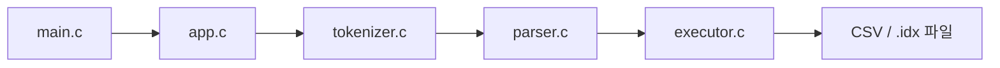
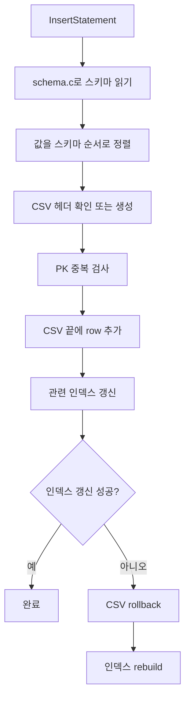
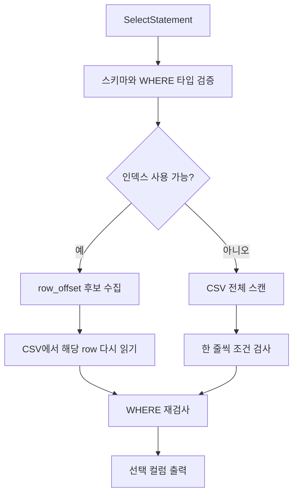
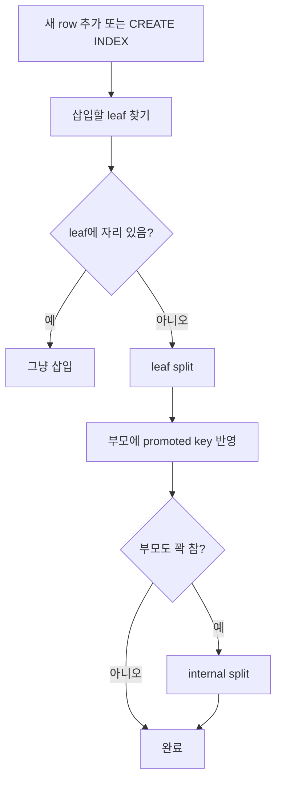

# sqlproc 코드 리딩 노트

이 문서는 `study/choeyeongbin-code-reading` 브랜치에서
`refactoring` 내용을 반영한 뒤 다시 정리한 개인 학습 노트입니다.

목표는 두 가지입니다.

- 지금 프로그램이 어떤 순서로 움직이는지 한 장으로 기억하기
- 코드를 읽을 때 "다음에 어느 파일을 보면 되는지" 바로 떠오르게 만들기

## 1. 제일 먼저 기억할 큰 흐름



이 그림은 여전히 유효합니다.  
리팩터링이 들어가도 프로그램의 핵심 파이프라인은 바뀌지 않았습니다.

한 줄 요약:

> SQL 문자열을 받아서, 토큰과 AST로 해석하고, 마지막에 CSV와 인덱스 파일에 반영하는 프로그램

## 2. refactoring 후 달라진 읽기 포인트

리팩터링 이후 코드를 읽을 때는 아래를 먼저 보면 됩니다.

- 함수 위 한국어 설명 주석이 많이 추가되었습니다.
- 함수가 더 잘게 나뉘어서 "한 함수가 한 역할"을 맡는 구조가 더 분명해졌습니다.
- `executor.c`, `btree_index.c`는 성공 경로뿐 아니라 rollback, rebuild 같은
  실패 복구 흐름도 따라가기 쉬워졌습니다.
- `tests/test_runner.c`를 예제처럼 읽기가 더 좋아졌습니다.

즉 예전보다 "코드 줄 하나하나"보다 "함수 단위 역할"을 먼저 파악하기 좋은 상태입니다.

## 3. 파일별로 내가 이해한 역할

### main.c

`main.c`는 프로그램 시작점입니다.

- 운영체제가 넘겨준 `argc`, `argv`를 받습니다.
- `parse_arguments()`를 호출합니다.
- 성공하면 `run_program()`에 실행을 넘깁니다.

중요:

- 여기서는 SQL 문장을 직접 읽거나 실행하지 않습니다.
- 말 그대로 "입구" 역할만 합니다.

### app.c

`app.c`는 실행 흐름 관리자입니다.

핵심 역할:

- 파일 모드인지 REPL 모드인지 결정
- SQL 한 문장이 완성됐는지 판단
- 완성된 SQL을 `run_sql_text()`로 넘김
- 오류가 나면 사용자에게 출력

내가 기억해야 할 함수:

- `parse_arguments()`
- `run_program()`
- `run_interactive_mode()`
- `run_sql_text()`

특히 중요한 점:

- 파일 모드와 REPL 모드는 처음만 다릅니다.
- 중간부터는 둘 다 `run_sql_text()`로 합쳐집니다.

## 4. tokenizer.c 와 parser.c는 "해석" 단계

### tokenizer.c

`tokenizer.c`는 문자열을 잘게 자릅니다.

예:

```sql
SELECT * FROM users WHERE age >= 20;
```

대략 이렇게 바뀝니다.

```text
[SELECT] [*] [FROM] [users] [WHERE] [age] [>=] [20] [;] [EOF]
```

즉 tokenizer는 문장을 낱말 카드로 자르는 역할입니다.

### parser.c

`parser.c`는 그 낱말 카드를 보고 문장 구조를 만듭니다.

예:

```sql
INSERT INTO users VALUES (1, 'kim', 20);
```

parser는 이 문장을 보고 아래 같은 정보를 구조체에 담습니다.

- 문장 종류: `INSERT`
- 테이블 이름: `users`
- 값 목록: `1`, `kim`, `20`

중요:

- parser는 아직 파일을 만지지 않습니다.
- 여기서는 오직 "문장을 이해해서 AST를 만드는 것"만 합니다.

## 5. executor.c는 진짜 일을 하는 곳

`executor.c`는 parser가 만든 AST를 실제 동작으로 바꿉니다.

### INSERT 흐름



여기서 내가 이해한 핵심:

- `schema.c`는 규칙을 가져옵니다.
- `executor.c`는 그 규칙대로 CSV를 만집니다.
- 인덱스 갱신이 실패하면 CSV와 인덱스 상태가 어긋나지 않게 복구합니다.

### SELECT 흐름



여기서 중요한 점:

- 인덱스는 행 전체를 저장하지 않습니다.
- 인덱스는 `row_offset`만 저장합니다.
- 그래서 인덱스를 써도 CSV를 다시 읽는 단계가 필요합니다.

## 6. schema.c는 데이터를 저장하지 않는다

이 부분은 헷갈리기 쉬워서 따로 적습니다.

`schema.c`는:

- 컬럼 이름
- 컬럼 타입
- `:pk` 여부

를 읽습니다.

즉 `schema.c`는 데이터가 아니라 "규칙"을 읽는 모듈입니다.

실제 레코드 저장은 `executor.c`가 합니다.

## 7. btree_index.c는 색인표를 관리한다

`btree_index.c`는 `.idx` 파일을 관리합니다.

초심자 비유:

- CSV는 원본 장부
- 인덱스는 빨리 찾기용 색인표

### 내가 기억해야 할 흐름



중요:

- leaf에는 `key + row_offset`이 있습니다.
- internal node는 길 안내 역할만 합니다.
- split이 일어나면 부모까지 영향이 올라갈 수 있습니다.

## 8. tests/test_runner.c를 같이 봐야 하는 이유

리팩터링 이후에는 테스트도 더 읽기 좋은 예시가 됩니다.

테스트를 보면:

- 어떤 SQL을 넣었는지
- 어떤 파일 상태를 기대하는지
- 어떤 오류를 막으려는지

를 바로 볼 수 있습니다.

즉 테스트는 "자동 검증 코드"이면서 동시에 "실행 예제 모음"입니다.

## 9. 지금 내 머릿속에 남겨야 할 문장

### 가장 짧은 요약

1. `main.c`가 시작한다.
2. `app.c`가 입력을 정리한다.
3. `tokenizer.c`가 SQL 문자열을 자른다.
4. `parser.c`가 AST를 만든다.
5. `executor.c`가 CSV와 인덱스를 만진다.
6. 필요하면 `btree_index.c`가 B+ 트리를 갱신한다.

### 헷갈리면 다시 볼 문장

- parser는 파일을 읽지 않는다.
- schema는 규칙을 읽는다.
- executor가 실제 데이터를 만진다.
- 인덱스는 row 전체가 아니라 row 위치를 저장한다.
- REPL과 파일 모드는 초반만 다르고 중간부터 같은 파이프라인이다.
