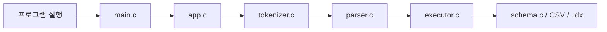
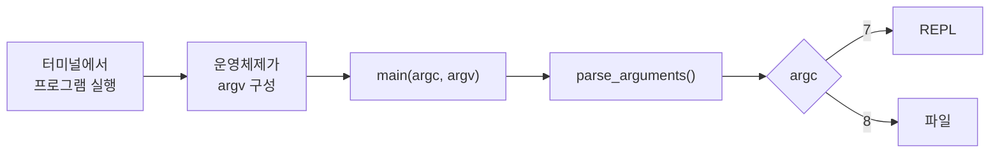
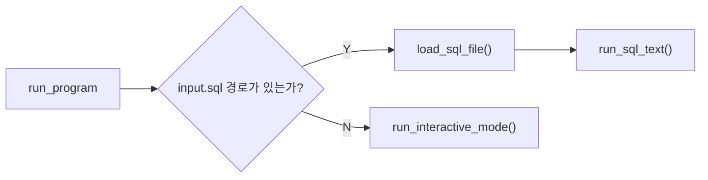
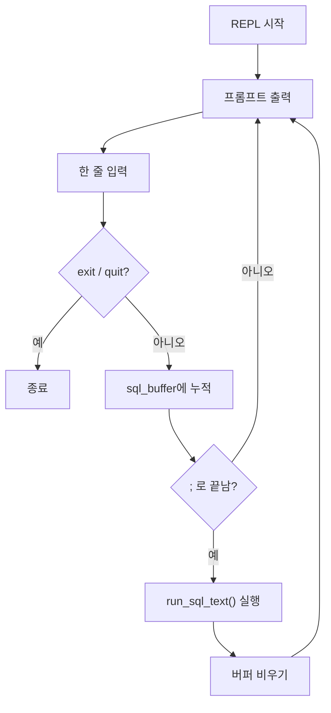
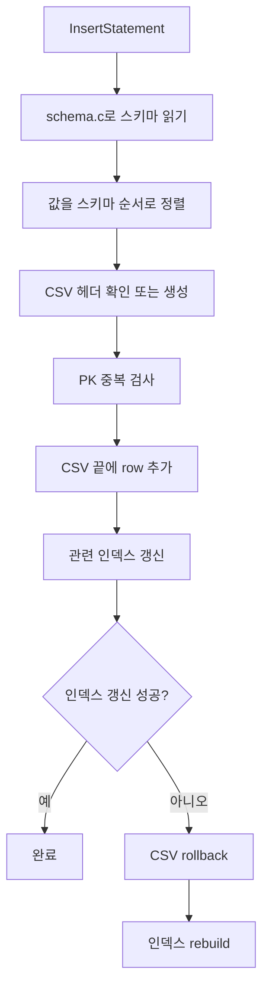
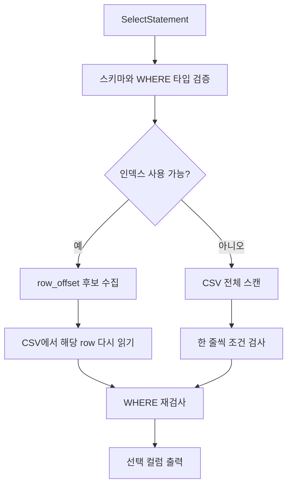
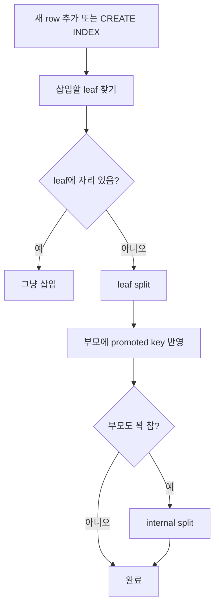

# sqlproc 코드 리딩 노트

이 문서는 `study/choeyeongbin-code-reading` 브랜치에서
`refactoring` 내용을 반영한 뒤 다시 정리한 개인 학습 노트입니다.

목표는 두 가지입니다.

- 지금 프로그램이 어떤 순서로 움직이는지 한 장으로 기억하기
- 코드를 읽을 때 "다음에 어느 파일을 보면 되는지" 바로 떠오르게 만들기

## 1. 프로그램 파이프라인



한 줄 요약:

> SQL 문자열을 받아서, 토큰과 AST로 해석하고, 마지막에 CSV와 인덱스 파일에 반영하는 프로그램

## 2. 프로그램 실행 방법


### 2-1. 터미널 명령어

먼저 프로그램을 빌드합니다.

```bash
make
```

`make`는 소스코드를 컴파일해서 실행 파일 `./build/sqlproc`를 만드는 명령어입니다.

빌드가 끝나면 아래 두 가지 방식으로 실행할 수 있습니다.

- REPL 모드:
  `REPL(Read-Eval-Print Loop)`은 터미널에서 SQL을 한 줄씩 입력하고,
  바로 실행 결과를 확인하는 대화형 모드입니다.

  schema-dir : 테이블 규칙
  

```bash
./build/sqlproc --schema-dir ./examples/schemas --data-dir ./demo-data --index-dir ./demo-indexes
```

- 파일 모드:
  미리 작성한 SQL 파일을 한 번에 실행하는 모드입니다.

```bash
./build/sqlproc --schema-dir ./examples/schemas --data-dir ./demo-data --index-dir ./demo-indexes ./examples/demo.sql
```

### 2-2. 터미널 명령어에 넘기는 옵션

이 프로그램은 실행할 때 아래 세 가지 경로를 알아야 합니다.

- `--schema-dir`
  테이블 규칙이 들어 있는 디렉터리입니다.
  예를 들어 `users` 테이블을 읽을 때는
  `./examples/schemas/users.schema` 같은 파일을 찾습니다.

- `--data-dir`
  실제 CSV 데이터 파일이 저장되는 디렉터리입니다.
  예를 들어 `users` 테이블 데이터는
  `./demo-data/users.csv` 같은 파일에 저장됩니다.

- `--index-dir`
  B+ 트리 인덱스 파일이 저장되는 디렉터리입니다.
  예를 들어 `CREATE INDEX idx_users_age ON users(age);`를 실행하면
  `./demo-indexes/idx_users_age.idx` 같은 파일이 생깁니다.

쉽게 비유하면:

- `schema-dir` = 양식 설명서 보관함
- `data-dir` = 실제 데이터 보관함
- `index-dir` = 빨리 찾기 위한 색인표 보관함

왜 이 값을 인자로 넘기냐면,
프로그램이 실행될 때마다 어떤 스키마 폴더, 어떤 데이터 폴더,
어떤 인덱스 폴더를 쓸지 바꿀 수 있어야 하기 때문입니다.

예를 들어 아래 명령은:

```bash
./build/sqlproc --schema-dir ./examples/schemas --data-dir ./demo-data --index-dir ./demo-indexes
```

프로그램에게 이렇게 말하는 것과 같습니다.

- 스키마는 `./examples/schemas`에서 읽어라
- 데이터는 `./demo-data`에서 읽고 써라
- 인덱스는 `./demo-indexes`에 저장해라


## 3. 각 파일 별 역할

### 3-1. main.c

`main.c`는 프로그램 시작점입니다.

프로그램이 실행되기 전에는 아래 과정이 먼저 일어납니다.

- 사용자가 터미널에 명령어를 입력합니다.
- 쉘이 명령어를 공백 기준으로 나누어 실행 파일 경로와 인자 목록을 만듭니다.
- 운영체제가 실행 파일을 메모리에 올리고, 프로그램 실행에 필요한 스택과 실행 환경을 준비합니다.
- 이때 쉘로부터 받은 인자 목록으로 `argv`, 인자 개수인 `argc`, 환경 변수 목록인 `envp`도 함께 준비됩니다.
- 그 뒤 C 런타임을 거쳐 `main(argc, argv)`가 호출됩니다.

`main.c` 안에서는 아래 일을 합니다.

- 운영체제가 준비한 `argc`, `argv`를 받습니다.
- `parse_arguments()`를 호출해 명령행 인자를 `AppConfig` 프로그램 실행 설정을 담는 구조체로 정리합니다.
- 인자 형식이 올바르면 `run_program()`에 실행을 넘깁니다.

즉 `main.c`는 SQL을 직접 실행하는 곳이라기보다,
프로그램 실행에 필요한 입력 정보를 받아 다음 단계로 넘기는 입구 역할을 합니다.

### 3-2. app.c

`app.c`는 실행 흐름 관리자입니다.

핵심 역할:

- 파일 모드인지 REPL 모드인지 결정
- SQL 한 문장이 완성됐는지 판단
- 완성된 SQL을 `run_sql_text()`로 넘김
- 오류가 나면 사용자에게 출력

특히 중요한 점:

- 파일 모드와 REPL 모드는 처음만 다릅니다.
- 중간부터는 둘 다 `run_sql_text()`로 합쳐집니다.

#### 3-2-1. parse_arguments()
- argv에 들어 있는 명령행 인자들을 읽어서 AppConfig 구조체에 정리하는 함수입니다.

#### 3-2-2. run_program()

- `main.c`가 넘겨준 `AppConfig`를 받아 최종적으로 어떤 방식으로 SQL을 실행할지 결정하는 함수입니다.



1. `AppConfig` 안의 `has_input_path` 값을 확인합니다.
2. SQL 파일 경로가 없으면 REPL 모드로 들어갑니다.
3. SQL 파일 경로가 있으면 파일 내용을 읽습니다.
4. 준비된 SQL 문자열을 `run_sql_text()`로 넘깁니다.
5. 실패하면 오류를 출력하고 종료 코드를 반환합니다.

#### 3-2-3. run_interactive_mode()
- 사용자가 SQL을 한 줄씩 입력하면, 세미콜론(;)이 나올 때까지 모았다가 실행하고, 다시 다음 입력을 받는 함수입니다.


1. 종료 명령인지 검사합니다.
2. 종료 명령이면 run_sql_text()를 실행하지 않고 바로 함수를 종료합니다.
3. 종료 명령이 아니면 입력한 내용을 sql_buffer에 누적합니다.
4. 문장이 세미콜론(;)으로 끝나면 run_sql_text(config, sql_buffer, &error)를 실행합니다.

#### 3-2-4. run_sql_text()

- SQL 문자열 1개를 실제 실행 파이프라인으로 넘기는 공통 함수입니다.

이 함수는 아래 세 단계를 순서대로 수행합니다.

1. `tokenize_sql()`
   SQL 문자열을 토큰으로 나눕니다.
2. `parse_program()`
   토큰 배열을 AST 구조체로 바꿉니다.
3. `execute_program()`
   AST를 실제 SQL 동작으로 실행합니다.

즉 이 함수는 문자열 형태의 SQL을 받아
`토큰화 -> 파싱 -> 실행`
순서로 연결하는 역할을 합니다.

## 4. tokenizer.c 와 parser.c는 "해석" 단계

### tokenizer.c

`tokenizer.c`는 문자열을 잘게 자릅니다.

예:

```sql
SELECT * FROM users WHERE age >= 20;
```

대략 이렇게 바뀝니다.

```text
[SELECT] [*] [FROM] [users] [WHERE] [age] [>=] [20] [;] [EOF]
```

즉 tokenizer는 문장을 낱말 카드로 자르는 역할입니다.

### parser.c

`parser.c`는 그 낱말 카드를 보고 문장 구조를 만듭니다.

예:

```sql
INSERT INTO users VALUES (1, 'kim', 20);
```

parser는 이 문장을 보고 아래 같은 정보를 구조체에 담습니다.

- 문장 종류: `INSERT`
- 테이블 이름: `users`
- 값 목록: `1`, `kim`, `20`

중요:

- parser는 아직 파일을 만지지 않습니다.
- 여기서는 오직 "문장을 이해해서 AST를 만드는 것"만 합니다.

## 5. executor.c는 진짜 일을 하는 곳

`executor.c`는 parser가 만든 AST를 실제 동작으로 바꿉니다.

### INSERT 흐름



여기서 내가 이해한 핵심:

- `schema.c`는 규칙을 가져옵니다.
- `executor.c`는 그 규칙대로 CSV를 만집니다.
- 인덱스 갱신이 실패하면 CSV와 인덱스 상태가 어긋나지 않게 복구합니다.

### SELECT 흐름



여기서 중요한 점:

- 인덱스는 행 전체를 저장하지 않습니다.
- 인덱스는 `row_offset`만 저장합니다.
- 그래서 인덱스를 써도 CSV를 다시 읽는 단계가 필요합니다.

## 6. schema.c는 데이터를 저장하지 않는다

이 부분은 헷갈리기 쉬워서 따로 적습니다.

`schema.c`는:

- 컬럼 이름
- 컬럼 타입
- `:pk` 여부

를 읽습니다.

즉 `schema.c`는 데이터가 아니라 "규칙"을 읽는 모듈입니다.

실제 레코드 저장은 `executor.c`가 합니다.

## 7. btree_index.c는 색인표를 관리한다

`btree_index.c`는 `.idx` 파일을 관리합니다.

초심자 비유:

- CSV는 원본 장부
- 인덱스는 빨리 찾기용 색인표

### 내가 기억해야 할 흐름



중요:

- leaf에는 `key + row_offset`이 있습니다.
- internal node는 길 안내 역할만 합니다.
- split이 일어나면 부모까지 영향이 올라갈 수 있습니다.

## 8. tests/test_runner.c를 같이 봐야 하는 이유

리팩터링 이후에는 테스트도 더 읽기 좋은 예시가 됩니다.

테스트를 보면:

- 어떤 SQL을 넣었는지
- 어떤 파일 상태를 기대하는지
- 어떤 오류를 막으려는지

를 바로 볼 수 있습니다.

즉 테스트는 "자동 검증 코드"이면서 동시에 "실행 예제 모음"입니다.

## 9. 지금 내 머릿속에 남겨야 할 문장

### 가장 짧은 요약

1. `main.c`가 시작한다.
2. `app.c`가 입력을 정리한다.
3. `tokenizer.c`가 SQL 문자열을 자른다.
4. `parser.c`가 AST를 만든다.
5. `executor.c`가 CSV와 인덱스를 만진다.
6. 필요하면 `btree_index.c`가 B+ 트리를 갱신한다.

### 헷갈리면 다시 볼 문장

- parser는 파일을 읽지 않는다.
- schema는 규칙을 읽는다.
- executor가 실제 데이터를 만진다.
- 인덱스는 row 전체가 아니라 row 위치를 저장한다.
- REPL과 파일 모드는 초반만 다르고 중간부터 같은 파이프라인이다.
