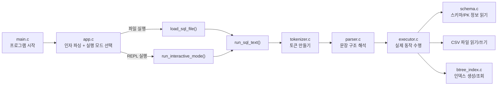
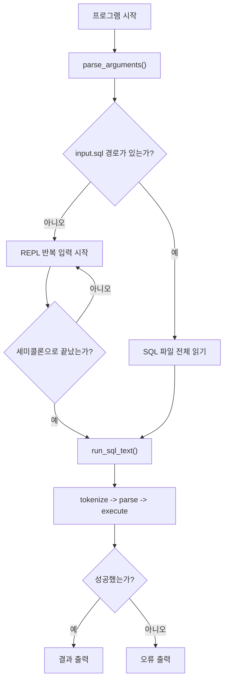
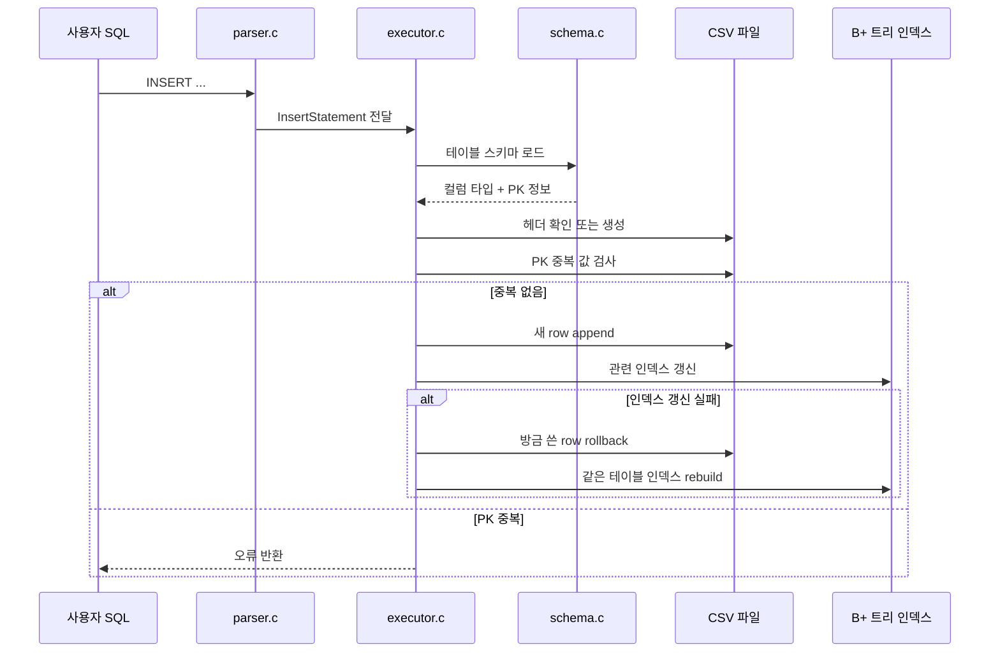
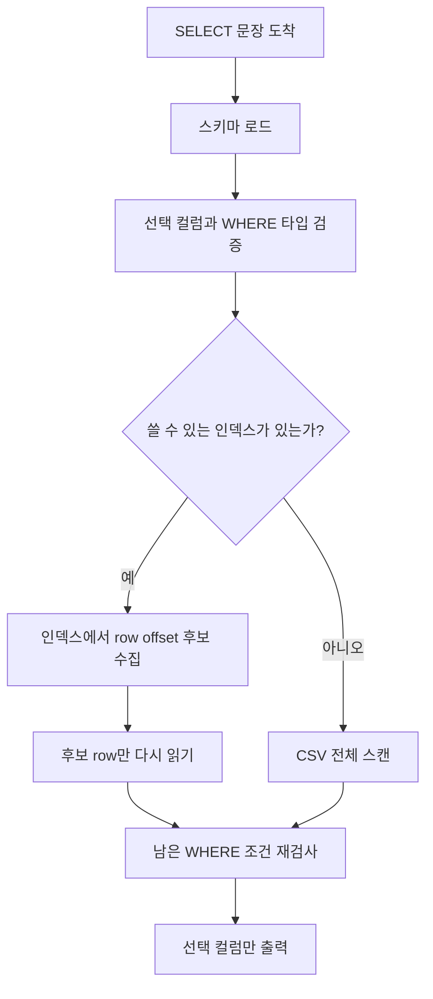
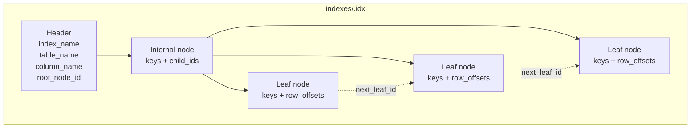

# refactoring 브랜치 초심자 시각화 가이드

이 문서는 `refactoring` 브랜치의 현재 코드 구조를 초심자 기준으로 쉽게
이해할 수 있도록 정리한 자료입니다.

핵심 목표는 아래 두 가지입니다.

- "어떤 파일이 무슨 일을 하는지"를 빠르게 파악하기
- "SQL 한 문장이 들어오면 어디를 거쳐 실행되는지"를 그림으로 이해하기

## 1. 먼저 큰 그림 보기

이 프로젝트는 "입력 -> 토큰화 -> 파싱 -> 실행 -> 파일 반영" 순서로 움직입니다.



### 이 그림에서 기억하면 좋은 점

- `app.c`는 "입력을 어디서 받을지"를 결정합니다.
- `tokenizer.c`와 `parser.c`는 문장을 해석만 합니다.
- 실제 파일 입출력은 `executor.c`와 `btree_index.c`에서 일어납니다.

## 2. 파일별 역할

| 파일 | 역할 | 초심자 메모 |
| --- | --- | --- |
| `src/main.c` | CLI 진입점 | 가장 바깥쪽 시작점입니다. |
| `src/app.c` | 파일 모드/REPL 모드 선택 | `input.sql`이 있으면 파일, 없으면 REPL입니다. |
| `src/tokenizer.c` | SQL을 토큰으로 나눔 | 쉼표, 괄호, 키워드, 문자열을 구분합니다. |
| `src/parser.c` | 토큰을 AST로 바꿈 | `INSERT`, `SELECT`, `CREATE INDEX` 문장을 읽습니다. |
| `src/schema.c` | `.schema` 파일 해석 | 타입과 `:pk` 정보를 읽습니다. |
| `src/executor.c` | 실제 SQL 실행 | CSV 저장/조회, PK 검사, WHERE 평가를 담당합니다. |
| `src/btree_index.c` | B+ 트리 인덱스 처리 | `.idx` 파일 생성, split, 조회를 담당합니다. |
| `tests/test_runner.c` | 통합 테스트 | 동작 예시를 코드로 따라가기에 좋습니다. |

## 3. 입력 모드: 파일 실행과 REPL은 어디서 갈라질까

`refactoring` 브랜치의 중요한 변화 중 하나는 REPL 모드가 더 분명해졌다는 점입니다.



### 초심자 포인트

- REPL 모드와 파일 모드는 중간부터 같은 `run_sql_text()`로 합쳐집니다.
- 즉, "입력받는 방법"만 다르고 실제 해석과 실행 코드는 거의 같습니다.

## 4. INSERT는 어떻게 실행될까

`INSERT`는 단순히 CSV 한 줄을 추가하는 것으로 끝나지 않습니다.
이 브랜치에서는 PRIMARY KEY 검사와 인덱스 갱신까지 같이 일어납니다.



### 여기서 중요한 이유

- `schema.c`는 "이 컬럼이 PK인지"를 알려 줍니다.
- `executor.c`는 CSV와 인덱스를 둘 다 맞춰야 해서 가장 일이 많습니다.
- 인덱스 실패 시 rollback과 rebuild가 함께 있는 이유는
  "CSV와 인덱스가 서로 다른 상태가 되면 안 되기 때문"입니다.

## 5. SELECT는 어떻게 실행될까

`SELECT`는 인덱스를 쓸 수 있으면 먼저 후보를 모으고,
없으면 CSV 전체를 읽습니다.



### 초심자 포인트

- 인덱스는 "행 전체"를 저장하지 않고 `row_offset`만 저장합니다.
- 그래서 인덱스를 쓴 뒤에도 실제 CSV 행을 다시 읽는 단계가 필요합니다.
- `WHERE a AND b`일 때, 인덱스는 한 조건만 먼저 쓰고
  나머지 조건은 나중에 다시 검사할 수 있습니다.

## 6. B+ 트리 인덱스는 파일 안에 어떻게 생겼을까

이 프로젝트의 B+ 트리는 성능보다 이해하기 쉬운 구조를 우선합니다.



### 이 그림을 읽는 방법

- `Header`는 "이 인덱스가 어느 테이블, 어느 컬럼용인지" 알려 줍니다.
- internal node는 "어느 자식으로 내려갈지" 결정합니다.
- leaf node는 실제 `key`와 `row_offset`을 가집니다.
- leaf끼리 연결돼 있어서 범위 조회를 이어서 볼 수 있습니다.

## 7. 왜 row_offset을 저장할까

초심자는 종종 "인덱스에 그냥 row 전체를 넣으면 안 되나?"라고 생각할 수 있습니다.

이 프로젝트는 아래처럼 단순하게 설계했습니다.


이렇게 하면:

- 인덱스 파일이 너무 커지지 않고
- CSV를 진짜 데이터 저장소로 유지하면서
- 인덱스는 "빠르게 위치만 찾는 역할"에 집중할 수 있습니다.

## 8. 초심자가 코드를 읽는 순서 추천

처음 읽는다면 아래 순서를 권장합니다.

1. `README.md`
2. `src/main.c`
3. `src/app.c`
4. `src/parser.c`
5. `src/executor.c`
6. `src/schema.c`
7. `src/btree_index.c`
8. `tests/test_runner.c`

### 이유

- `main.c`와 `app.c`를 먼저 보면 프로그램 입구가 보입니다.
- `parser.c`를 보면 어떤 SQL만 지원하는지 감이 옵니다.
- `executor.c`를 보면 "실제 파일 반영"이 이해됩니다.
- 마지막에 `btree_index.c`를 보면 큰 자료구조가 덜 무섭게 느껴집니다.

## 9. 자주 헷갈리는 포인트

### 1. 파서는 파일을 읽지 않습니다

- `parser.c`는 SQL 문장을 구조로 바꾸는 역할만 합니다.
- 실제 CSV나 `.idx` 파일은 `executor.c`, `btree_index.c`가 만집니다.

### 2. schema.c는 데이터가 아니라 규칙을 읽습니다

- `schema.c`는 컬럼 타입과 PK 여부를 알려 주는 도우미입니다.
- 실제 레코드 저장은 하지 않습니다.

### 3. REPL과 파일 모드는 결국 같은 실행 파이프라인으로 갑니다

- 초반 입력 방식만 다릅니다.
- 해석과 실행 단계는 최대한 재사용합니다.

### 4. 인덱스가 있어도 CSV를 다시 읽을 수 있습니다

- 인덱스는 위치만 알려 줍니다.
- 실제 결과 출력은 CSV를 다시 읽어야 합니다.

## 10. 이 문서를 본 뒤 바로 해 보면 좋은 것

### 1. 배치 실행

```bash
mkdir -p ./demo-data ./demo-indexes
./build/sqlproc \
  --schema-dir ./examples/schemas \
  --data-dir ./demo-data \
  --index-dir ./demo-indexes \
  ./examples/demo.sql
```

### 2. REPL 실행

```bash
./build/sqlproc \
  --schema-dir ./examples/schemas \
  --data-dir ./demo-data \
  --index-dir ./demo-indexes
```

그 다음 아래를 직접 입력해 보면 구조가 더 잘 보입니다.

```sql
INSERT INTO users VALUES (1, 'kim', 20);
INSERT INTO users VALUES (2, 'lee', 30);
CREATE INDEX idx_users_age ON users(age);
SELECT * FROM users WHERE age >= 20;
quit
```
