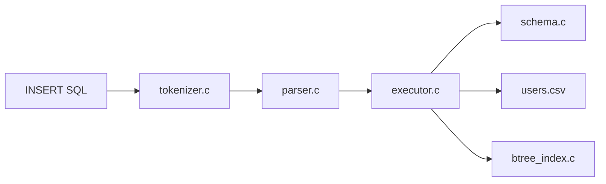
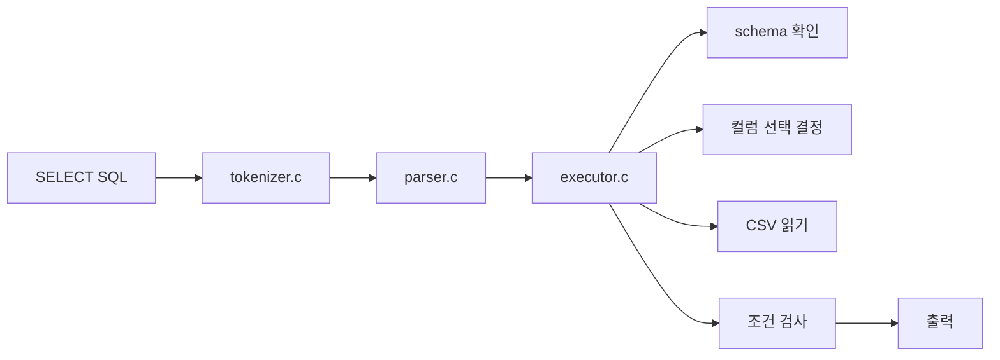
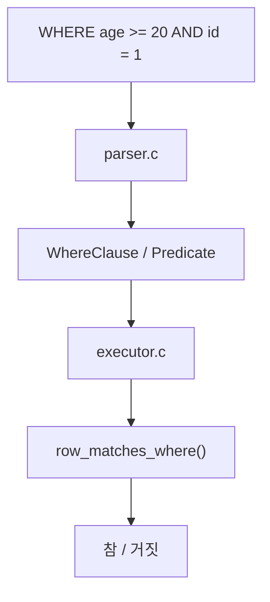
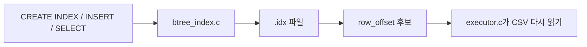
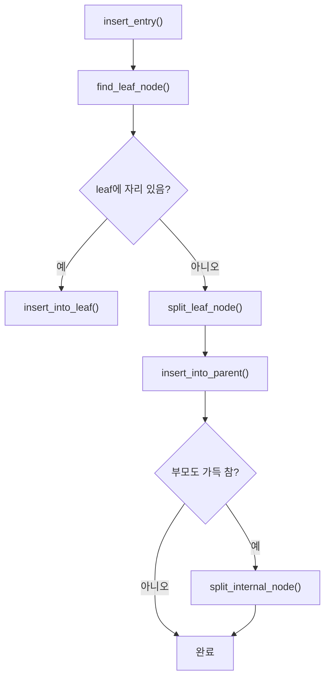
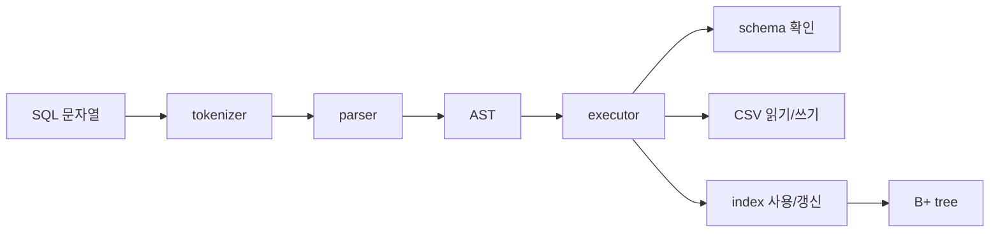

# sql 실행 동작 원리 심화 노트

이 문서는 `study/choeyeongbin-code-reading` 브랜치에서
`INSERT -> SELECT -> WHERE -> INDEX -> B+TREE`
동작 원리를 프로젝트 코드 기준으로 깊게 정리하기 위한 학습 문서입니다.

이 문서의 목표는 아래 두 가지입니다.

- 기능별 실행 흐름을 코드와 연결해서 이해하기
- "어느 함수가 언제 호출되는지"를 따라가며 실제 동작 원리를 파악하기

## 목차

1. [INSERT 동작 원리](#1-insert-동작-원리)
2. [SELECT 동작 원리](#2-select-동작-원리)
3. [WHERE 동작 원리](#3-where-동작-원리)
4. [INDEX 동작 원리](#4-index-동작-원리)
5. [B+ TREE 동작 원리](#5-b-tree-동작-원리)
6. [전체 연결 흐름](#6-전체-연결-흐름)

## 1. INSERT 동작 원리

`INSERT`는 문자열로 시작하지만, 실제로는 아래 순서로 처리됩니다.

핵심 함수:

- `parse_insert_statement()`
- `execute_insert()`
- `build_insert_row_values()`
- `validate_primary_key_insert()`
- `write_csv_row()`

핵심 흐름:

1. SQL 문자열이 토큰화됩니다.
2. parser가 `InsertStatement` AST를 만듭니다.
3. executor가 스키마를 읽습니다.
4. 값을 스키마 순서로 정리합니다.
5. PK 중복을 검사합니다.
6. CSV 끝에 row를 추가합니다.
7. 관련 인덱스를 갱신합니다.

이 문서의 다음 작성 포인트:

- `INSERT INTO users VALUES (...)` 예시를 실제 구조체 기준으로 적기
- `row_values`가 어떻게 만들어지는지 정리하기
- 인덱스 갱신 실패 시 rollback 흐름 그리기

## 2. SELECT 동작 원리

`SELECT`는 조건 없이 단순 출력하는 경우와,
WHERE / INDEX를 함께 쓰는 경우로 나눠 생각하면 이해하기 쉽습니다.

핵심 함수:

- `parse_select_statement()`
- `execute_select()`
- `resolve_selected_columns()`
- `print_selected_header()`

핵심 흐름:

1. parser가 `SelectStatement` AST를 만듭니다.
2. executor가 출력할 컬럼을 결정합니다.
3. WHERE 절이 유효한지 확인합니다.
4. 인덱스를 쓸 수 있으면 후보를 먼저 모읍니다.
5. 아니면 CSV 전체를 읽습니다.
6. 조건에 맞는 row만 출력합니다.

이 문서의 다음 작성 포인트:

- `SELECT *`와 `SELECT name, age` 차이 정리
- 인덱스 경로와 full scan 경로 비교

## 3. WHERE 동작 원리

WHERE는 parser 단계와 executor 단계로 나눠서 봐야 합니다.

- parser에서는 "조건을 구조체로 정리"합니다.
- executor에서는 "실제 row와 비교"합니다.

핵심 함수:

- `parse_where_clause()`
- `parse_predicate()`
- `validate_where_clause()`
- `row_matches_where()`
- `compare_values()`

핵심 흐름:

1. parser가 컬럼명, 연산자, 리터럴을 읽습니다.
2. 조건 최대 2개를 `WhereClause`에 담습니다.
3. executor가 컬럼이 실제 스키마에 있는지 확인합니다.
4. 타입이 맞는지 확인합니다.
5. 각 row 값을 조건과 비교합니다.

이 문서의 다음 작성 포인트:

- `Predicate` 구조체 예시 적기
- int 비교와 string 비교 차이 적기

## 4. INDEX 동작 원리

인덱스는 `SELECT`를 빠르게 하기 위한 보조 자료구조입니다.

중요:

- 인덱스는 row 전체를 저장하지 않습니다.
- 인덱스는 `key`와 `row_offset`을 저장합니다.

핵심 함수:

- `create_index_from_statement()`
- `update_all_indexes_for_row()`
- `try_collect_offsets_from_indexes()`

핵심 흐름:

- `CREATE INDEX`
  새 `.idx` 파일을 만들고 기존 CSV row를 읽어 인덱스를 채웁니다.
- `INSERT`
  새 row가 생기면 관련 인덱스에도 엔트리를 추가합니다.
- `SELECT`
  WHERE 조건에 맞는 row offset 후보를 먼저 모읍니다.

이 문서의 다음 작성 포인트:

- 왜 row_offset만 저장하는지 자세히 적기
- 인덱스를 써도 CSV를 다시 읽는 이유 정리

## 5. B+ TREE 동작 원리

이 프로젝트의 인덱스는 B+ 트리 기반입니다.

초심자 기준 핵심:

- leaf node는 실제 `key + row_offset`을 가집니다.
- internal node는 자식 방향만 안내합니다.
- leaf node끼리는 `next_leaf_id`로 연결됩니다.

핵심 함수:

- `find_leaf_node()`
- `insert_into_leaf()`
- `split_leaf_node()`
- `insert_into_parent()`
- `split_internal_node()`

이 문서의 다음 작성 포인트:

- leaf / internal node 구조체 직접 그리기
- split이 왜 필요한지 예시로 설명하기
- BST와 B+ 트리 차이 정리하기

## 6. 전체 연결 흐름

결국 이 프로젝트는 아래 흐름으로 이해할 수 있습니다.

